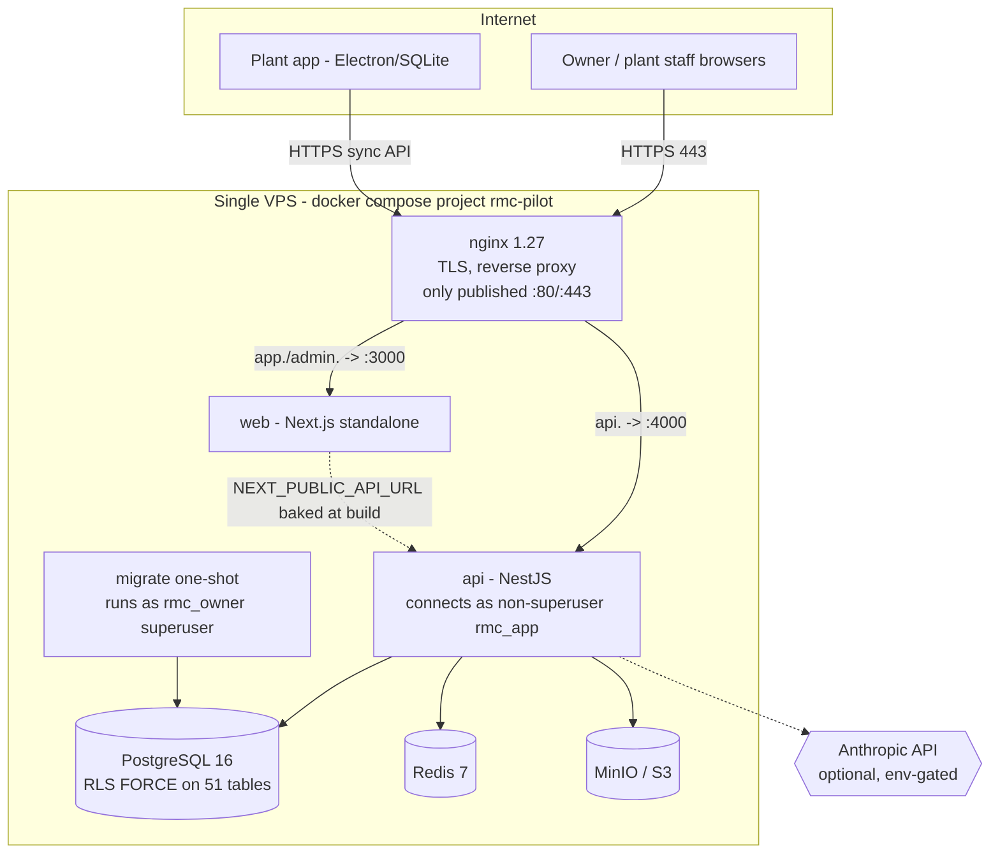
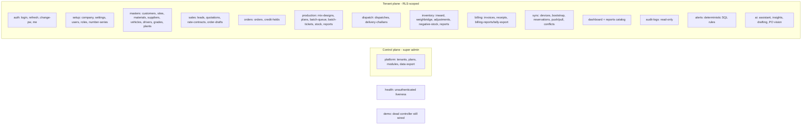
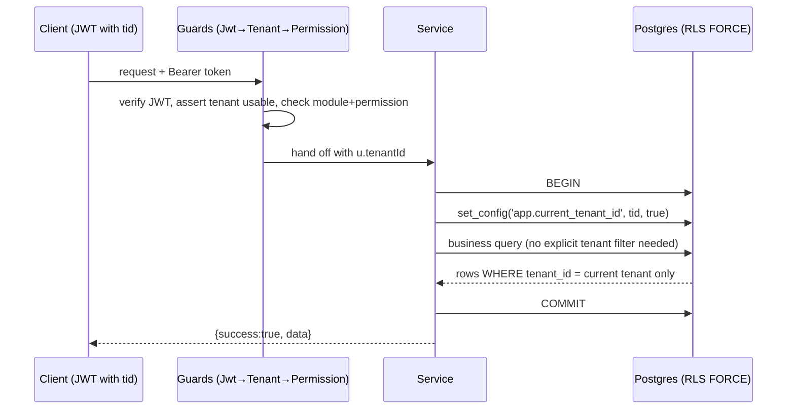

# As-Is System Architecture — Mix Nova RMC

> **Status:** Evidence-based audit of the system as it exists on branch
> `claude/rmc-plant-saas-requirements-6df8ur` (HEAD `0d1d025`), 2026-08-09.
> Every capability below is classified by how strongly its *reality* is
> established, not by how it is described in design docs.
>
> Companion documents: `REQUIREMENT_TRACEABILITY_MATRIX.md` (intent vs built),
> `GAP_REGISTER_AND_RISK_REGISTER.md` (scoring), `TARGET_HYBRID_ARCHITECTURE.md`
> (to-be). This document is the single source of *what is true today*.

## 1. Status vocabulary

Because "done" is ambiguous, every capability in this audit is tagged with one
of seven statuses:

| Tag | Meaning |
|---|---|
| **PROD-VERIFIED** | Confirmed working on the live pilot box by the owner in a prior session (e.g. a real order-to-cash run, live tenant-isolation probe). |
| **IMPL-UNVERIFIED** | Code is implemented and reachable, exercised by local/CI tests, but not independently confirmed on the live box. |
| **PARTIAL** | Implemented for the happy path or a subset; real gaps remain (documented in-code or found in audit). |
| **DOC-ONLY** | Specified in an SRS/design doc; **no working code** (or only stored DB fields with no behaviour). |
| **PLANNED** | Explicitly deferred to a later phase by the product docs. |
| **MISSING** | Needed for the stated product goal but neither built nor scheduled. |
| **UNCLEAR** | Cannot be determined from the repo alone; needs a live check or an owner decision. |

The sandbox performing this audit **cannot reach the live host** (proxy blocks
`mixnovas.com`) and has **no SSH access**, so `PROD-VERIFIED` reflects only what
the owner has previously confirmed and pasted back. Everything else that runs is
`IMPL-UNVERIFIED` at best.

## 2. Product in one paragraph

Mix Nova RMC is a **multi-tenant SaaS for Indian Ready-Mix Concrete plants**.
Each tenant is one RMC company (with one or more plants); the platform covers
the commercial-to-cash core — masters → quotation → order (with credit control)
→ production/batching → dispatch/delivery challan → inventory → GST invoice →
receipt → outstanding — plus a super-admin control plane for tenants, plans and
modules, an offline-capable plant app, and an optional AI assistant. It is live
on a single MilesWeb VPS serving a pilot tenant.

## 3. Technology stack (verified)

| Layer | Choice | Evidence |
|---|---|---|
| Monorepo | pnpm 10.33 workspaces + Turborepo | `pnpm-workspace.yaml`, `turbo.json` |
| API | NestJS 11, TypeScript, `/api/v1` global prefix | `apps/api/src/main.ts:33` |
| Web | Next.js 15 App Router, React 19, `output: 'standalone'` | `apps/web/next.config.mjs:48` |
| Plant app | Electron + `node:sqlite` (offline) | `apps/plant-app/src/sync/*` |
| Shared | `@rmc/shared` (permissions, enums, validation, password policy) — consumed from `dist/` | `packages/shared/src/*` |
| Database | PostgreSQL 16 + Row-Level Security | `docker/docker-compose.prod.yml`, migrations |
| Cache / objects | Redis 7, MinIO (S3-compatible) | compose services |
| Edge | nginx 1.27 (TLS termination, reverse proxy) | `docker/nginx/templates/rmc.conf.template` |
| AI | `@anthropic-ai/sdk`, env-gated | `apps/api/src/ai/anthropic.service.ts` |

## 4. Deployment topology (as-is)

Single 4 GB VPS ("VM3"), all services in one `docker compose` project
(`rmc-pilot`). Only nginx is internet-facing.



**Key facts and foot-guns:**
- Postgres/Redis/MinIO have **no published ports** — internal bridge only.
- The **`migrate` one-shot** runs migrations + `seed-prod` as the superuser
  `rmc_owner`; the long-running `api` connects as the non-superuser `rmc_app`,
  which is subject to RLS.
- Deploy is **manual** (`scripts/ops/redeploy.sh`); there is **no CD**. Images
  are built off-box and pushed to GHCR (`build-images.yml`) so the 4 GB host only
  pulls (a `docker build` OOMs it). A freshness guard refuses to redeploy a
  checkout that is behind `origin` (`redeploy.sh:47-64`) — added after the "I
  redeployed but the fix isn't live" incident.
- There is **no staging environment** and **no HA**: loss of VM3 loses the
  service, the on-box monitor, and the on-box backups simultaneously.

## 5. Backend module map (verified)

20 NestJS modules, all under `/api/v1`, each declaring its own guards (there is
**no** global auth guard; the only global guard is the rate limiter).



**Guard stack (per request):** `JwtAuthGuard` → `TenantGuard` (tenant user?
subscription still usable? `@RequireModule` in plan?) → `CrudPermissionsGuard` /
`PermissionsGuard` (`module.action` keys) → `SuperAdminGuard` on the control
plane. Tenant isolation is then enforced **at the database** by RLS.

## 6. Data model & tenancy (the strongest part of the system)

**58 tables** total: 7 global/platform tables (no `tenant_id`), 51
tenant-scoped tables with `tenant_id NOT NULL` and RLS.

**RLS is implemented to the textbook-safe standard** (identical policy on all 51
tenant tables, `Init.ts:154-164`):

```sql
ALTER TABLE t ENABLE ROW LEVEL SECURITY;
ALTER TABLE t FORCE ROW LEVEL SECURITY;               -- even the table owner obeys
CREATE POLICY tenant_isolation ON t
  USING      (tenant_id = current_setting('app.current_tenant_id', true)::uuid)  -- reads
  WITH CHECK (tenant_id = current_setting('app.current_tenant_id', true)::uuid); -- writes
CREATE INDEX idx_t_tenant ON t (tenant_id);           -- tenant_id-leading
```

- The app role `rmc_app` is created **inside** the Init migration as a plain
  `LOGIN` role — **no `SUPERUSER`, no `BYPASSRLS`** — so it cannot escape the
  policy. The superuser `rmc_owner` (the Postgres bootstrap role) runs migrations
  and cross-tenant seeds and bypasses RLS by virtue of being a superuser.
- The tenant is set **transaction-locally** per request:
  `TenantDbService.runInTenant` opens a transaction and calls
  `set_config('app.current_tenant_id', tid, true)` (the `true` = `SET LOCAL`
  semantics). This is exactly the mitigation the research flags as the **#1 RLS
  pooling bug** — and it is done correctly here. The tenant id comes only from
  the JWT `tid` claim, never from the client.
- `current_setting(..., true)` returns `NULL` when unset → policy **fails
  closed** (a query that forgets `runInTenant` returns nothing / is rejected).
- `audit_logs` is granted only `SELECT, INSERT` to `rmc_app` — append-only is a
  **database privilege**, not a convention. No UPDATE/DELETE path exists.



**Known data-model gaps** (detail in the gap register): `users` and
`tenant_modules` carry `tenant_id` but have **no RLS** (isolation is
app-enforced there); foreign keys reference `id` alone, not `(tenant_id, id)`,
so tenant co-membership is not a DB invariant; there are **no CHECK
constraints** anywhere (negative money/quantity and invalid status strings are
DB-legal); `stock_transactions.plant_id` is still nullable; `vehicles.driver_id`
has no FK.

## 7. Capability status map

### 7.1 Multi-tenancy & platform
| Capability | Status | Notes |
|---|---|---|
| Shared-DB + `tenant_id` + RLS isolation | PROD-VERIFIED | Owner ran live probe: `rmc_app` is `f/f` (not superuser, no bypass); cross-tenant read = 0; CI `rls-isolation.test.mjs` asserts 9 invariants. |
| Super-admin tenant/plan/module control | IMPL-UNVERIFIED | `platform.*` endpoints, super-admin-only. |
| Subscription/module gating per request | IMPL-UNVERIFIED | `TenantGuard` re-checks on every request; **fail-open** if a tenant has zero module rows or no plan. |
| Tenant data export / offboarding | IMPL-UNVERIFIED | `platform/tenants/:id/export` strips `password_hash`; `offboard-tenant.sh` export-then-purge, backup-first. |
| SaaS billing (invoices, gateway, coupons) | DOC-ONLY / PLANNED | No SaaS-billing code; foundation only per SRS §2.5. |

### 7.2 Order-to-cash core
| Capability | Status | Notes |
|---|---|---|
| Masters CRUD (9 entities) + CSV import/export | IMPL-UNVERIFIED | Generic `MasterCrud` + `BaseCrudController`; field validation (GSTIN/mobile/credit) wired. |
| Quotation → approval → convert | IMPL-UNVERIFIED | Full lifecycle incl. revisions, PDF, `wa.me` share. |
| Rate contracts | IMPL-UNVERIFIED | Approval workflow, convert to order-draft. |
| Order booking + credit check + credit-hold | PROD-VERIFIED | Live order-to-cash run confirmed; auto-routes over-limit orders to `credit_hold` (L2), release is human. |
| Production plan / batch queue / batch ticket | IMPL-UNVERIFIED | Manual batch entry; variance vs tolerance auto-computed, blocks on breach unless override; writes inventory ledger. |
| Mix design + approval | PARTIAL | Approval gate works; **create/edit ungated by permission** (least-privilege gap). |
| Dispatch board + delivery challan | IMPL-UNVERIFIED | Statuses manual/event-based (no live GPS). |
| Inventory: inward, adjustment, weighbridge (manual), negative-stock approval | IMPL-UNVERIFIED | Stock ledger; ghost-row null-plant bug fixed (migration 14 + `stock-ledger` CI test). |
| GST invoice (mixed HSN/SAC, CGST/SGST/IGST, round-off) | PROD-VERIFIED | Order-to-cash run produced correct GST totals (e.g. CGST 4050 / total 53100 in UAT; ₹2,95,000 owner run). |
| Receipt + allocation + outstanding ageing | IMPL-UNVERIFIED | Auto-allocation across invoices; ageing 0-30/31-60/61-90/90+. |
| Company profile + logo on invoice PDF | PROD-VERIFIED | Owner confirmed full profile + logo render on live invoices. |

### 7.3 Offline & sync
| Capability | Status | Notes |
|---|---|---|
| Cloud sync API (device register, bootstrap, reservations, push/pull, conflicts) | IMPL-UNVERIFIED | Real, gated, `sync.manage`. |
| Plant app (Electron+SQLite) outbox + reserved numbering | IMPL-UNVERIFIED | Working `engine.js`/`schema.js`; `selftest.js` drives full cycle against a live API. |
| Offline ops coverage | PARTIAL | **Only 3 of ~10**: create challan, create batch ticket, update challan. Inward/weighbridge/dispatch-update/stock all rejected as `unsupported_entity`. |
| Conflict resolution | PARTIAL | Optimistic concurrency on `updatedAt`; only `keep_cloud`/`keep_local`; no `manual_merge`, no conflict audit. |
| Retry/backoff, sync-run log, local backup, offline audit, offline login | MISSING | Columns exist (`retry_count`) but never used; no scheduler; app takes a pasted bearer token in an **unencrypted** SQLite file. |
| Device revocation enforcement | MISSING | Endpoints check device *exists*, never `status==='active'`. |

### 7.4 Integrations (the weakest area — mostly DOC-ONLY)
| Capability | Status | Notes |
|---|---|---|
| Tally | PARTIAL | CSV **file export** of one voucher type; no live API, no receipt/ledger export, no export-batch tracking. |
| GST e-invoice / IRN | DOC-ONLY | Columns stored (`irn`, `signed_qr_code`, `einvoice_status='not_generated'`); **no generation, no GSTN call**. |
| E-way bill | DOC-ONLY | Stored fields only; no API. |
| WhatsApp | PARTIAL | Builds a `wa.me` click-to-chat link + logs a row; **no Cloud API send, no templates, no delivery status**. |
| Payments / UPI | MISSING | Manual receipt only; no gateway/webhook/dependency. |
| SMS | MISSING | No provider code at all → no OTP / password-reset / reminders by SMS. |
| Email / SMTP | MISSING | **Zero mail transport** anywhere in the codebase. |
| Weighbridge hardware | DOC-ONLY | Manual entry only; no serial/TCP/Modbus/RS232. |
| Batch-controller (Putzmeister/IDS/CSV import) | DOC-ONLY / PLANNED | Batch tickets are manual `sourceType:'manual'`; no importer, no connector config. |
| GPS / telematics | DOC-ONLY / PLANNED | Lat/long columns exist, never populated. |
| Integration provider registry (`integration_providers`, `tenant_integrations`, `integration_logs`, `batching_connector_configs`) | MISSING | The architectural backbone DESIGN-DOC-10 assumes **does not exist in the schema**. Adding any live integration is greenfield. |

### 7.5 Security, RBAC, audit, AI
| Capability | Status | Notes |
|---|---|---|
| JWT auth (access 15 min + refresh 14 d) | IMPL-UNVERIFIED | Separate secrets; **weak defaults** (`change-me-*`) can boot in prod; **no refresh rotation/revocation**. |
| RBAC (`module.action`, 14 roles, SoD defaults) | IMPL-UNVERIFIED (RBAC matrix) | Real separation of duties; **production-plans & mix-design create/edit ungated** (permission gap). |
| Append-only audit trail + secret redaction | IMPL-UNVERIFIED | Grant-enforced append-only; recursive redaction of secret-like keys; best-effort post-commit. |
| Rate limiting | IMPL-UNVERIFIED | Global 100/60s; login 5/60s; app-layer only (no nginx-edge WAF). |
| nginx TLS/HSTS/security headers | IMPL-UNVERIFIED | Set at container start; **API responses carry no Helmet headers**. |
| Web token storage | PARTIAL (risk) | Access **and** refresh tokens in `localStorage`; CSP limits exfiltration but `script-src` allows `unsafe-inline`/`unsafe-eval`. |
| AI assistant / insights / drafting / PO vision | PARTIAL | Real Anthropic SDK integration, read-only tools, graceful 503 without key — **but targets an API surface (`claude-opus-5`, `output_config`) that may be ahead of the installed SDK** → could 500 at call time. |
| Alerts (deterministic) | IMPL-UNVERIFIED | Pure SQL over the ledger; cannot state an unreal figure. |

### 7.6 Ops, tests, DR
| Capability | Status | Notes |
|---|---|---|
| CI (lint, typecheck, build, integration) | IMPL-UNVERIFIED (CI green) | 4-file integration suite runs against real Postgres in CI. |
| Unit-test coverage | MISSING | **0%** — no jest/vitest/nyc/c8; large API surface (ai, billing internals, platform lifecycle, sync server, alerts) untested. |
| Manual e2e suite (`tests/`) | PARTIAL | Rich (isolation, RBAC, UAT, security) but **not wired into CI**. |
| GFS backups + rehearsed restore drill | IMPL-UNVERIFIED (scripts) | Well-built; installation on VM3 not verifiable from repo. |
| Off-box backups | MISSING | Opt-in plumbing (`RMC_OFFBOX_*`) unset; only Acronis VM image is truly off-box. |
| Monitoring | PARTIAL | Health + RSC 5xx cron scripts + generic webhook; **no APM/metrics/tracing/log-aggregation/error-tracking**. |
| Staging / CD / HA | MISSING | Single box, manual deploy. |

## 8. Autonomy snapshot (detail in `AUTONOMOUS_PRODUCT_BLUEPRINT.md`)

**Nothing in the system today exceeds L2 (Prepare/assist).** Every state change
is user-triggered; the software computes, suggests, and applies *deterministic*
effects (credit exposure, GST math, variance, allocation) but never initiates or
auto-executes a financial/legal/irreversible action on its own. There is **no
scheduler, cron, queue worker, or background actor** in the codebase — the AI
assistant is explicitly read-only with no write tool. This is a *safe* baseline
to grow autonomy from, not a limitation to apologise for.

## 9. What "as-is" gets right, in one list

1. **DB-enforced tenant isolation done to the safe standard** — and independently
   validated by the benchmark research as the correct RLS recipe.
2. **Separation of duties baked into RBAC defaults** (sales can't approve pricing,
   QC owns mix approval, auditor is view-only).
3. **Guardrails that block, not auto-approve** (credit hold, variance breach,
   negative stock all require a human with the right permission).
4. **Append-only audit as a privilege**, with secret redaction.
5. **A real, tested offline MVP** (outbox + reserved numbering that cannot collide
   with online numbering).
6. **Unusually thoughtful ops tooling for a pilot** (gated redeploy with a
   freshness guard, GFS backups, a rehearsed restore drill).

## 10. What "as-is" is missing, in one list

1. **Integrations are ~90% documented-but-not-built** — no live e-invoice/e-way,
   payments, SMS, email, weighbridge, or batch-controller; the provider registry
   the design assumes doesn't exist.
2. **Offline sync is narrow and fragile** — 3 of ~10 ops, a wall-clock cursor
   with a real lost-update path, no retry/backup/offline-auth/device-revocation.
3. **No unit tests, no staging, no HA, no off-box backups, no observability.**
4. **Auth hardening debt** — localStorage tokens, no refresh rotation, weak
   default secrets, no Helmet on the API, a few ungated write endpoints.
5. **Compliance is manual** — IRN/e-way must be produced on the government portal
   outside the system and hand-keyed back.

These are the inputs to the gap register, the target architecture, and the
roadmap.
