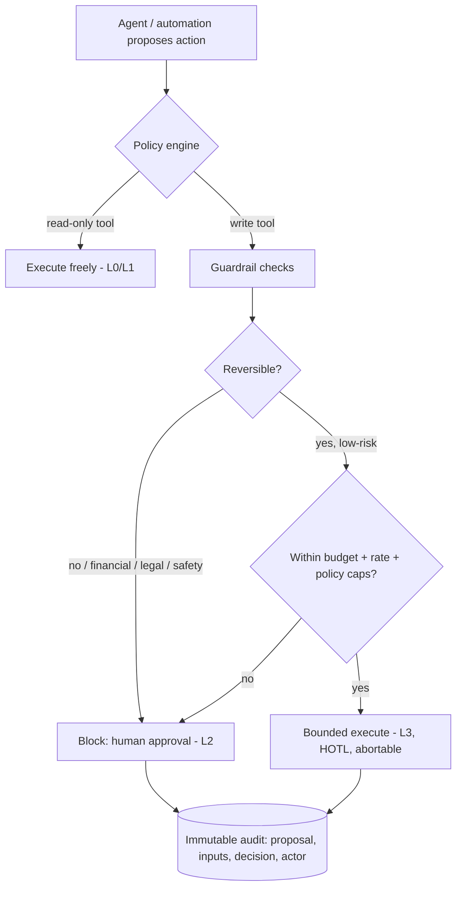

# Autonomous Product Blueprint — Mix Nova RMC

> How Mix Nova earns the word "autonomous" **safely**: a per-capability autonomy
> ladder (L0–L5), the hard rule that financial/legal/safety/irreversible actions
> never exceed L4, the guardrail architecture that makes higher levels possible,
> and a phased path from today's L0–L2 baseline. Research-backed (SAE-analogous
> autonomy taxonomy, HITL/HOTL guidance, agentic-ERP governance). No
> implementation here.
>
> **Multi-agent layer:** the concrete five-agent system (Data-Analysis,
> Automation, Customer-Service, Monitor, Specialist) that operationalises this
> ladder is designed in `MULTI_AGENT_SYSTEM_ARCHITECTURE.md`.

## 1. Autonomy ladder (the definitions we will use)

Adapted from the enterprise L0–L4 execution scale and the SAE-analogous
"levels of autonomy for AI agents" literature, extended to L5 for completeness.

| Level | Name | The system… | Human role |
|---|---|---|---|
| **L0** | Manual | does nothing on its own; pure CRUD | Operator does everything |
| **L1** | Assist / Draft | computes, suggests, drafts; recommends an action | Human executes |
| **L2** | Prepare | assembles a complete, structured action and **blocks for approval** | Human approves the submission |
| **L3** | Bounded execute | executes **reversible, low-risk** actions under explicit policy + budget caps, logged | Human on-the-loop, can intervene/abort |
| **L4** | High-autonomy execute | executes **high-impact** actions only under explicit, monitored risk-acceptance with strong rollback/escalation | Human accountable, exception-only |
| **L5** | Full autonomy | acts with no in-execution human intervention | Observer only |

**The hard rule (non-negotiable in this product):**
> **Financial, legal, safety-critical, and irreversible actions never exceed L4,
> and default to L2.** Reversibility is the governing metric — money, GST/IRN,
> e-way bills, contract commitments, inventory write-downs, and load
> accept/reject are exactly the low-reversibility, high-impact cases that must
> stay human-approved. This mirrors both the agentic-AI guidance and the RMC
> domain's legal boundaries (IS 4926 site-water/discharge attestation, GST
> penalties).

## 2. Where Mix Nova is today

**Nothing exceeds L2, and most is L0–L1.** There is no scheduler, cron, queue
worker, or background actor anywhere; the AI assistant is explicitly read-only
with no write tool. This is the *right* place to start — a safe, auditable
baseline, not a deficiency.

| Capability | Today | Evidence |
|---|---|---|
| Masters / settings / leads CRUD | L0 | Pure user-triggered CRUD |
| Quotation / rate-contract lifecycle | L0–L1 | Computes lines/PDF; human approves |
| Document numbering | L1 | Atomic auto-allocation, no decision |
| **Credit assessment + auto credit-hold** | **L2** | Auto-computes exposure and **blocks** over-limit orders; release requires `credit_hold.approve` |
| **Batch-ticket variance control** | **L2** | Auto-computes variance vs tolerance, **blocks on breach** unless override, then writes the ledger |
| **GST invoice generation** | **L2** | Auto CGST/SGST/IGST/round-off; issue/cancel are separate human, permission-gated steps |
| Receipt allocation | L2 | Auto-allocates across invoices; human initiates |
| Alerts (deterministic) | L1 | Read-only SQL; executes nothing |
| AI assistant / insights / drafting / PO vision | L1 | Read-only tools; drafts text; a human acts |

The existing L2 behaviours are exemplary autonomy design: **the autonomous part
is the conservative one** (compute exposure, block on breach), and the
consequential part (release, issue, override) stays human. Keep this pattern as
the template for everything new.

## 3. Target autonomy by capability

The blueprint assigns a **ceiling** (never exceed) and a **target** (where it
should sit once guardrails exist) per capability. Ceilings encode the hard rule.

| Capability | Ceiling | Target | Rationale |
|---|---|---|---|
| Reorder-point suggestions (cement/aggregate/admixture) | L3 | **L1→L3** | Recommend now; later auto-raise a *draft* purchase requisition (reversible) under budget caps, human confirms PO. |
| Dispatch scheduling / truck sequencing | L3 | **L1→L3** | Suggest optimal sequence/ETA; auto-re-sequence only if reversible, budget-capped, abortable (HOTL). Never auto-commit a customer delivery promise. |
| Mix optimisation (cost/strength/CO₂) | L2 | **L1→L2** | ML *recommends*; a QC engineer **must approve** the mix design (safety-critical). Ceiling L2. |
| Credit-hold **release** | **L2** | L2 | Financial. Auto-*prepare* the release packet; a human with `credit_hold.approve` commits. Never above L4; keep at L2. |
| Invoice / IRN / e-way generation | **L2** | L2 | Legal/financial. Auto-*prepare* the invoice and pre-fill IRN/e-way payloads; **human signs off**; then the *transmission* to IRP/EWB may be an L3 bounded, retryable, logged job (the network call is mechanical; the *decision* was human). |
| GST return preparation (GSTR-1/3B) | **L2** | L1→L2 | Auto-reconcile and draft; a human files. |
| Payment reminders (WhatsApp/SMS/email) | L3 | **L1→L3** | Draft now; later auto-send on a schedule **within opt-in/consent + rate caps + quiet hours** (reversible, low-risk) with full logging. |
| Anomaly / QC alerting | L3 | **L1→L2** | Flag out-of-spec batches, overdue receivables, negative stock; may auto-*open* an approval request (reversible), never auto-resolve. |
| Predictive maintenance (fleet/plant sensors) | L3 | **L1→L3** | Predict failures; auto-*schedule* a maintenance task (reversible), human dispatches. |
| Load accept/reject at site | **L2** | L2 | Safety-critical (IS 4926). AI advises; a qualified person accepts/rejects and attests. |
| Anything touching money movement / GST filing / contract commitment | **L2** | L2 | Hard rule. |

**No capability in this product is ever assigned L5.**

## 4. Guardrail architecture (the prerequisite for L3+)

Higher autonomy is *earned* by building guardrails as a **layer**, not by
trusting prompts. Nothing in the product may move above L2 until these exist.

**Required components:**
1. **Scoped tools** — read tools and write tools are separate, allow-listed sets.
   The AI assistant today already has *only* read tools; keep that boundary and
   add write tools **one at a time**, each behind policy.
2. **Policy engine** — declarative rules: which capability may auto-execute, its
   reversibility class, budget/rate/quiet-hour caps, and the tenant/role that
   owns the exception.
3. **Approval workflow** — the generic `approval_requests`/`approval_actions`
   engine the design already specifies (SRS §15) becomes the L2 substrate for
   *all* prepared actions, not just credit-hold and negative-stock.
4. **Reversibility & rollback** — every L3 action has a defined inverse and an
   abort path (HOTL). If an action cannot be cleanly reversed, it is L2 by
   definition.
5. **Immutable audit** — extend the existing append-only `audit_logs` to record
   agent/automation proposals, inputs, the policy decision, and the human actor.
   This doubles as the DPDP and OWASP audit evidence.
6. **Kill switch & budget** — per-tenant global "pause all automation" and a
   token/action budget so a runaway loop is bounded (the research's #1 failure
   mode for agentic projects).

## 5. Phased autonomy roadmap

Autonomy is earned gradually: dry-run → read-only observation → simulation →
staged execution → production with limited scope.

| Wave | Theme | Moves | Gate to advance |
|---|---|---|---|
| **A (now)** | Trustworthy L0–L2 | Keep the current block-not-approve pattern; make the AI path robust; unify all approvals under one engine | Approval engine + audit of proposals in place |
| **B** | Decision support (L1) everywhere | Reorder points, dispatch suggestions, mix recommendations, anomaly flags, drafted reminders/returns | Suggestions measured for precision; humans trust them |
| **C** | Bounded execution (L3) for reversible ops | Auto-send reminders within consent+caps; auto-open approval requests; auto-schedule maintenance; auto-re-sequence dispatch (abortable) | Policy engine + rollback + kill switch + per-tenant opt-in |
| **D** | Assisted compliance (L2/L3) | Prepare IRN/e-way/GSTR payloads (L2 human sign-off); transmit as L3 retryable jobs *after* sign-off | Live e-invoice/e-way integration exists and is stable |
| **E** | Continuous optimisation | Fleet/plant predictive maintenance, demand forecasting feeding L1 recommendations | Sensor/telematics integration exists |

**Never in scope:** unattended plant operation, auto-filing GST returns,
auto-committing customer contracts, auto-issuing invoices/IRN without human
sign-off, auto-accepting/rejecting a concrete load.

## 6. Marketing vs reality (a note to the owner)

"Autonomous" in this domain — and in 2026 enterprise practice generally — means
**supervised autonomy**: AI for mix optimisation, dispatch, reminders, and
predictive maintenance, **with explicit human sign-off gates** on
invoicing/IRN/e-way/return-filing and on quality/safety acceptance. Positioning
the product as *fully* autonomous over financial or safety actions would be both
untrue today and unsafe to build. The honest, defensible claim is: **"an
autonomous assistant that prepares the work and enforces the guardrails, so your
team approves rather than keys."**
