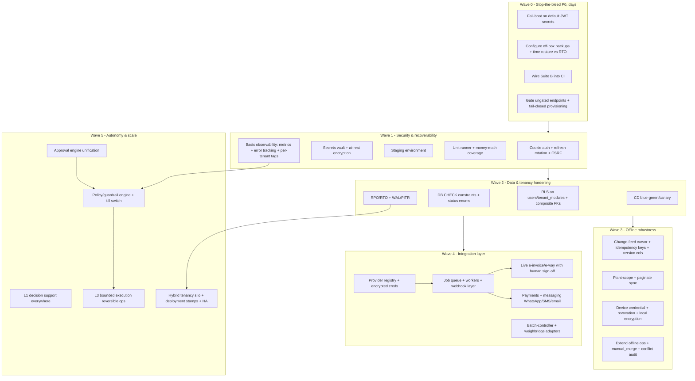
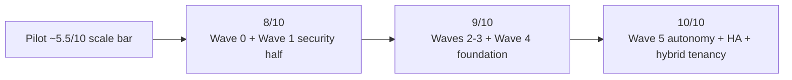

# Dependency-Aware Implementation Roadmap — Mix Nova RMC

> Turns the gap register into a **sequenced** plan: waves ordered so each unblocks
> the next, with prerequisites, effort (T-shirt), the gap/risk IDs it closes, and
> the 8→9→10 maturity milestones. Nothing here is implemented — this is the plan
> the owner approves work against.

## 1. Sequencing principles

1. **Safety and recoverability before features.** A second real tenant must not
   be onboarded onto a system that can lose its own backups or forge its own
   tokens.
2. **Unblock, don't parallelise blindly.** Some work is a prerequisite for other
   work (e.g. the provider registry precedes any live integration; the approval
   engine precedes L3 automation).
3. **Cheap, high-leverage fixes first.** Several P0s are a few hours (fail-boot on
   default secrets, wire Suite B, configure off-box backups) yet remove
   catastrophic risk.
4. **Never regress the strong core.** Every item is additive to the RLS/data
   layer, not a rewrite.

## 2. Dependency graph (waves)

## 3. Wave detail

### Wave 0 — Stop-the-bleed (P0, ~days) → closes toward **8/10**
| Item | Effort | Closes | Prereq |
|---|---|---|---|
| Fail the boot if `JWT_*_SECRET` is default/empty | XS | G1, R2 | — |
| Configure `RMC_OFFBOX_*`; run + **time** a restore drill against a stated RTO | S | G4, G13, R1 | off-box target decision (S3/Backblaze/other host) |
| Wire `tests/` Suite B (isolation/RBAC/security/UAT) into CI | S | G7, R4/R5 | seeded stack in CI job |
| Gate `production-plans` & `mix-design` writes; fail **closed** on unprovisioned tenants | S | G8, R8 | — |
| Remove/confirm dead demo controller | XS | G22 | — |

*Owner input needed:* the **off-box backup target** (S3/Backblaze bucket, a second
SSH host, or "not yet"). This is the one true blocker in Wave 0.

### Wave 1 — Security & recoverability → **8→8.5/10**
| Item | Effort | Closes | Prereq |
|---|---|---|---|
| Move refresh token to httpOnly/Secure/SameSite cookie + rotation + reuse detection; CSRF on writes | M | G2, R2 | cross-origin CORS/CSRF plan |
| Secrets manager (or sops/age) + rotation runbook; Postgres/MinIO at-rest encryption | M | G3, R2, R6 | — |
| Stand up a **staging** environment (prod-mirrored) | M | G5, R7 | infra/host decision |
| Add vitest + coverage; cover GST/tax, credit exposure, allocation, variance, validators, permission mapping | M | G7, R4 | — |
| Basic observability: OpenTelemetry metrics + error tracker + `tenant_id`/`plant_id` tags; external uptime | M | G10, R9 | — |

### Wave 2 — Data & tenancy hardening → **8.5/10**
| Item | Effort | Closes | Prereq |
|---|---|---|---|
| RLS (or DB tenant guard) on `users`/`tenant_modules`; migrate FKs to `(tenant_id, id)` where practical | M | G9, R5 | — |
| DB CHECK constraints (non-negative money/qty) + status enums; make `stock_transactions.plant_id` NOT NULL; add `vehicles.driver_id` FK | S–M | G9, R12 | data clean-up migration |
| Quantify RPO/RTO; add WAL archiving/PITR | M | G13, R1 | managed/HA Postgres decision |
| CD (blue/green or canary) behind LB; keep `redeploy.sh` as break-glass | M | G5, R7 | staging (Wave 1) |

### Wave 3 — Offline robustness → **offline 5→8/10**
| Item | Effort | Closes | Prereq |
|---|---|---|---|
| Monotonic change-feed cursor + UUIDv7 idempotency keys + `@VersionColumn` | M–L | G6, R3 | build-vs-buy ADR (custom vs PowerSync) |
| Plant-scope + paginate bootstrap/pull (kill the 500-row truncation) | M | G16, R3 | change-feed |
| Per-device credential + `status==='active'` enforcement + encrypted local store + bounded offline login | M | G16, R2 | — |
| Extend offline ops (inward/weighbridge/dispatch-update/stock); add `manual_merge` + conflict audit; retry/backoff + sync-run log | L | G16 | change-feed, idempotency |

### Wave 4 — Integration layer → **integrations 3→7/10, compliance 4→7/10**
| Item | Effort | Closes | Prereq |
|---|---|---|---|
| Provider registry (`integration_providers`, `tenant_integrations` w/ encrypted creds, `integration_logs`) | M | G11, R10 | secrets vault (Wave 1) |
| Job queue (BullMQ/Redis) + idempotent/retryable/logged workers + webhook receiver (signature + dup-ID) | M–L | G11, R10 | provider registry |
| Live **e-invoice/IRN + e-way** — prepare (L2 human sign-off) → transmit (L3 job) | L | G12, R10 | queue, GSP/IRP access, stable GST flow |
| **Payments** gateway (signed webhooks) + **messaging** (WhatsApp Cloud API, SMS, email/SMTP) with delivery status | L | G12, R14 | queue, provider registry |
| **Batch-controller + weighbridge adapters** (two-way recipe/weights, RS232/Modbus/TCP) at the edge | L | G12 | edge sync (Wave 3) |
| Missing masters (transporter, UOM/HSN/bank/payment-mode) | S | G18 | — |

### Wave 5 — Autonomy & scale → **9→10/10**
| Item | Effort | Closes | Prereq |
|---|---|---|---|
| Unify all approvals under one `approval_requests`/`approval_actions` engine | M | G17 | — |
| Policy/guardrail engine + scoped write tools + per-tenant kill switch + proposal audit | L | G17 | approval engine, observability |
| L1 decision support (reorder points, dispatch suggestions, mix recommendations, drafted reminders) | M–L | — | guardrails |
| L3 bounded execution for reversible ops (auto-send reminders within consent+caps; auto-open approvals; auto-schedule maintenance) | L | — | policy engine, messaging (Wave 4) |
| Hybrid tenancy: silo big tenants, deployment stamps, multi-AZ managed HA Postgres, stateless scaled app tier | L | G14, R1, R13 | PITR (Wave 2), staging/CD |
| DPDP: consent/notice, breach runbook, retention enforcement, data-principal access/erasure | M | G15, R6 | at-rest encryption (Wave 1) |
| i18n architecture (translation files, Indian-script PDF) | M | G19 | — |
| Frontend a11y + native-dialog cleanup + theme FOUC | S | G20 | — |

## 4. The 8 → 9 → 10 milestones

These map the waves to a maturity narrative the owner can track.

**Reach 8/10 (safe wider pilot / second tenant):** Wave 0 complete + the security
and recoverability half of Wave 1 (cookie auth, secrets, staging, off-box
backups, unit money-math, basic observability). *You can onboard a second paying
tenant without a catastrophic-risk footgun.*

**Reach 9/10 (production-grade multi-tenant):** Waves 2–3 + the integration
foundation of Wave 4 (provider registry, queue, live e-invoice/e-way with
sign-off, real messaging). *Data & tenancy hardened, DR quantified with PITR,
offline robust, compliance no longer manual, CD + staging in place.*

**Reach 10/10 (scaling, autonomous, enterprise-ready):** Wave 5 — hybrid tenancy
with siloed enterprise accounts + HA, the autonomy guardrail layer with L1–L3
capabilities, full DPDP posture, i18n. *Sells to certified/large producers with
SLAs, supervised autonomy, and a defensible compliance story.*

## 5. Relationship to the prior 8→9→10 plan

An earlier session began an "A1–A8 / R1–R6" plan and completed **A1** (CI
integration suite) and **A2** (rehearsed restore drill + runbook). Those map into
this roadmap as: A1 → Wave 0/1 testing; A2 → the restore-drill half of Wave 0's
backup item (the **off-box** half, A3, is the outstanding blocker). The remaining
prior items (key-only SSH A4, plant UAT R1, traceability R2 — now delivered as
`REQUIREMENT_TRACEABILITY_MATRIX.md`) fold into Waves 0–1. This roadmap supersedes
and re-sequences that list around the audit's risk ordering.

## 6. What to start now

Given the audit, the highest-leverage next actions — none of which touch the
strong core — are:
1. **Decide the off-box backup target** (the one blocker in Wave 0) and turn it on.
2. **Ship the three XS/S security-and-test fixes** (fail-boot on default secrets,
   wire Suite B, gate the ungated endpoints).
3. **Plan the cookie-auth migration** (Wave 1's biggest single risk reduction).

Each is small, reversible, and closes a top-5 risk.
