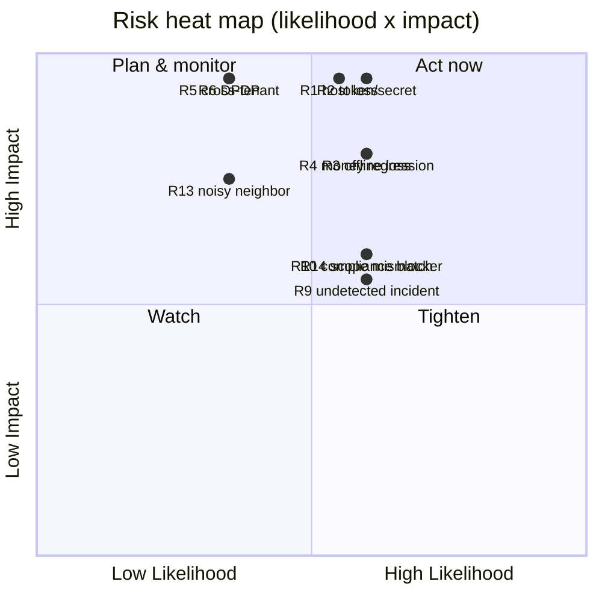

# Gap Register & Risk Register — Mix Nova RMC

> Dimension-by-dimension 0–10 scoring, a prioritised gap register (what's
> missing and why it matters), and a risk register (likelihood × impact →
> mitigation → owner). Scores are for the product *as it exists today* against
> what a production-grade, scaling multi-tenant RMC SaaS needs — not against the
> Phase-1 pilot bar alone. Evidence is in `AS_IS_SYSTEM_ARCHITECTURE.md`.

## 1. Scoring rubric

`0` absent · `1–3` early/fragile · `4–6` works but material gaps · `7–8` solid,
minor gaps · `9–10` production-grade at scale. Two lenses are given because they
tell different stories:
- **Pilot bar** — is it adequate for the current controlled single-tenant pilot?
- **Scale bar** — is it adequate for onboarding multiple paying tenants / an
  enterprise account?

## 2. Dimension scorecard

| # | Dimension | Pilot | Scale | One-line justification |
|---|---|---|---|---|
| 1 | **Multi-tenant isolation** | 9 | 8 | Textbook-safe RLS, test-proven, owner-probed; −points for `users`/`tenant_modules` no-RLS and single-column FKs. |
| 2 | **Data model & integrity** | 7 | 6 | Rich, well-normalised, tenant-scoped uniques; but **no CHECK constraints**, nullable `stock_transactions.plant_id`, missing FKs. |
| 3 | **Order-to-cash functional core** | 8 | 7 | Full spine built, tested, owner-verified incl. correct GST math. |
| 4 | **RBAC & authorization** | 7 | 6 | Real SoD, per-request re-check; **ungated production-plans/mix-design**, fail-open provisioning. |
| 5 | **AuthN & session security** | 4 | 3 | bcrypt + rate limit + no enumeration, but **localStorage tokens, no refresh rotation, weak default secrets, no MFA**. |
| 6 | **Secrets & data-at-rest** | 3 | 2 | Plaintext `.env` on host, **no vault, no rotation, no at-rest encryption**. |
| 7 | **Offline & sync** | 5 | 3 | Real tested MVP + collision-safe numbering, but **3/10 ops, wall-clock cursor lost-update bug, no retry/backup/device-cred**. |
| 8 | **Integrations (Tally/e-inv/e-way/pay/msg/hardware)** | 3 | 2 | Mostly **DOC-ONLY**; only a Tally CSV + `wa.me` link touch outside; **no provider registry, no queue/webhooks**. |
| 9 | **Compliance (GST/e-invoice, DPDP, IS 4926)** | 4 | 3 | e-inv/e-way *ready fields* per Phase-1 letter, but generation is manual/outside; **no DPDP consent/breach flow**; IS 4926 timers unmodelled. |
| 10 | **Audit & traceability** | 8 | 8 | Append-only by privilege + secret redaction; −points for unaudited conflict-resolution & retention not enforced. |
| 11 | **Autonomy readiness** | 6 | 5 | Safe L0–L2 baseline with block-not-approve; **no policy/guardrail engine** for L3+. |
| 12 | **Testing & QA** | 4 | 3 | Good integration money-path + RLS in CI; **0% unit coverage, Suite B unwired, no load/chaos/web tests**. |
| 13 | **CI/CD & environments** | 4 | 3 | CI gates quality; **no CD, no staging, manual single-operator deploy**. |
| 14 | **Backups & DR** | 6 | 4 | GFS + rehearsed restore drill (strong), but **off-box unconfigured, no PITR, RPO/RTO unquantified**. |
| 15 | **Observability** | 2 | 2 | Healthchecks + 2 cron scripts + generic webhook; **no APM/metrics/tracing/log-agg/error-tracking**. |
| 16 | **Resilience / HA** | 3 | 2 | **Single 4 GB box**, no HA, no autoscale; loss = total outage. |
| 17 | **Frontend quality & a11y** | 6 | 6 | Mature, uniformly wired, no stub pages; −points for label/field a11y, native dialogs leaking, theme FOUC. |
| 18 | **Documentation & requirements** | 8 | 8 | Unusually thorough SRS + 12 design docs + ops runbooks; −points where docs claim capability that's DOC-ONLY (i18n, integrations). |

**Weighted read:**
- **Requirements maturity: ~8/10.** The intent is exceptionally well-specified.
- **Architecture (as-built) maturity: ~5.5/10 at the scale bar.** A genuinely
  strong isolation/data/functional core (8–9) is pulled down by
  security-hygiene, integrations, offline robustness, testing, CI/CD,
  observability, and HA (2–4).

The gap between the two — well-designed, partially and unevenly built — is the
central finding.

## 3. Gap register (prioritised)

Priority = how much it blocks a safe, wider, multi-tenant pilot. **P0** = fix
before a second real tenant; **P1** = before scale; **P2** = maturity.

| ID | Gap | Pri | Dimension | Why it matters |
|---|---|---|---|---|
| G1 | Weak default JWT secrets can boot in prod | P0 | 5 | Forgeable tokens if env forgotten → full account takeover. |
| G2 | Access + refresh tokens in `localStorage`; no refresh rotation | P0 | 5 | XSS steals long-lived credentials; no revocation. |
| G3 | Secrets plaintext on host; no vault/rotation; no at-rest encryption | P0 | 6 | Host compromise = total; DPDP Rule 6 gap. |
| G4 | Off-box backups unconfigured | P0 | 14 | On-box backups die with the box; only Acronis is off-box. |
| G5 | No staging + manual single-operator deploy | P0 | 13 | No safe place to validate a deploy; human error goes straight to prod. |
| G6 | Sync wall-clock cursor lost-update + idempotency-on-retry bugs | P0* | 7 | Can lose/duplicate plant data. *P0 only if offline is in the next tenant's scope. |
| G7 | Zero unit coverage; Suite B unwired | P0 | 12 | Money math & guards can regress silently. |
| G8 | Ungated production-plans/mix-design writes; fail-open provisioning | P1 | 4 | Least-privilege violation; provisioning gap grants *more* access. |
| G9 | `users`/`tenant_modules` no RLS; single-column FKs; no CHECK constraints | P1 | 1,2 | Isolation & integrity depend on app hygiene, not the DB. |
| G10 | No observability (APM/metrics/tracing/log-agg/error-tracking) | P1 | 15 | Poor MTTD; blind to per-tenant/noisy-neighbor issues. |
| G11 | Integration provider registry + queue + webhooks absent | P1 | 8 | Every live integration is greenfield until this exists. |
| G12 | No live e-invoice/e-way/payment/SMS/email | P1 | 8,9 | Compliance & messaging are manual/outside the system. |
| G13 | RPO/RTO unquantified; no PITR | P1 | 14 | DR is undefined; can't promise recovery guarantees. |
| G14 | No HA; single 4 GB box | P1 | 16 | Any host loss = full outage; blocks SLA commitments. |
| G15 | DPDP consent/notice, breach runbook, retention enforcement missing | P1 | 9 | Regulatory exposure (₹200–250 cr scale) before May-2027. |
| G16 | Offline coverage 3/10 ops; no device credential/revocation | P1 | 7 | Plant can't fully operate offline; sync auth weak. |
| G17 | No autonomy policy/guardrail engine | P2 | 11 | Prerequisite for any L3+ automation. |
| G18 | Missing masters (transporter, UOM/HSN/bank/payment-mode tables) | P2 | 2 | Design R-refinements + e-way need them. |
| G19 | i18n architecture asserted but not evidenced | P2 | 18 | Doc/reality mismatch; blocks Indian-language promise. |
| G20 | Frontend a11y (label/field association), native dialogs, theme FOUC | P2 | 17 | Accessibility + polish. |
| G21 | AI targets an API surface (`claude-opus-5`, `output_config`) possibly ahead of the SDK | P2 | 3 | Could 500 at call time; verify before selling AI. |
| G22 | Dead demo controller wired in prod | P2 | 4 | Remove; confirm it exposes nothing. |

## 4. Risk register

Likelihood (L) and Impact (I) on 1–5; **Score = L × I**. Owner is the role
accountable, not a named person.

| ID | Risk | L | I | Score | Mitigation | Owner |
|---|---|---|---|---|---|---|
| R1 | **Host loss** (VM3 dies) → total outage + on-box backups & monitor lost | 3 | 5 | **15** | Off-box backups now (G4); staging + managed/HA Postgres before scale (G5, G14); Acronis as stopgap | Ops |
| R2 | **Token/secret compromise** (localStorage XSS, weak/leaked secrets, plaintext env) | 3 | 5 | **15** | Fail-boot on default secrets (G1); cookie auth + rotation (G2); secrets vault + at-rest encryption (G3) | Security |
| R3 | **Silent offline data loss/dup** via cursor & retry bugs | 3 | 4 | **12** | Change-feed cursor + idempotency keys + version columns + regression tests (G6) | Backend |
| R4 | **Regression in money/GST/allocation** ships undetected | 3 | 4 | **12** | Unit coverage of money math + wire Suite B into CI (G7) | QA |
| R5 | **Cross-tenant leak via app-enforced tables** (`users`/`tenant_modules`, or a missing filter) | 2 | 5 | **10** | Add RLS/DB tenant guard + composite FKs (G9); keep isolation tests | Backend |
| R6 | **DPDP non-compliance** (breach with no runbook, no consent) → penalty + reputational | 2 | 5 | **10** | Consent/notice, breach runbook, DPA, retention, at-rest encryption (G15, G3) | Compliance |
| R7 | **Deploy accident** (wrong tag/stale checkout/OOM build) | 3 | 3 | **9** | Freshness guard + pre-redeploy backup already in place; add staging + CD (G5) | Ops |
| R8 | **Privilege abuse via ungated endpoints / fail-open provisioning** | 3 | 3 | **9** | Gate the endpoints; fail closed on unprovisioned tenants (G8) | Backend |
| R9 | **Undetected incident** (no observability) prolongs any of the above | 3 | 3 | **9** | OpenTelemetry + error tracking + per-tenant tags + external uptime (G10) | Ops |
| R10 | **Compliance blocker at real volume** — customer needs live IRN/e-way and it's manual | 3 | 3 | **9** | Provider registry + IRP/e-way workers with human sign-off (G11, G12) | Product |
| R11 | **AI endpoint failure** if SDK/model surface mismatched | 2 | 3 | 6 | Verify SDK/model; graceful degrade already partial (G21) | Backend |
| R12 | **DB integrity drift** (negative stock/money, invalid status) | 2 | 3 | 6 | CHECK constraints; tighten validation (G9) | Backend |
| R13 | **Noisy-neighbor** degrades all pooled tenants at scale | 2 | 4 | 8 | Deployment stamps + silo big tenants + per-tenant SLO monitoring | Architecture |
| R14 | **Scope misrepresentation** — a buyer expects working WhatsApp/e-invoice/i18n | 3 | 3 | 9 | Align sales collateral to `REQUIREMENT_TRACEABILITY_MATRIX.md`; build the foundations (G12, G19) | Product |

**Top-5 by score:** R1 (host loss), R2 (secret/token compromise), R3 (offline
data loss), R4 (money regression), then the R5/R6/R10/R14 cluster at 9–10.
Notice the top risks are **operational and security-hygiene**, not functional —
the functional core is the healthy part.

## 5. Heat map

## 6. Bottom line

The scorecard tells a consistent story: **an 8/10 requirements effort and an
8–9/10 isolation/data/functional core, dragged to ~5.5/10 (scale bar) by
security hygiene, integrations, offline robustness, testing, CI/CD,
observability, and HA.** None of the top risks require touching the well-built
data layer; they are additive, well-understood hardening and infrastructure
work — which is exactly what makes the roadmap tractable.
