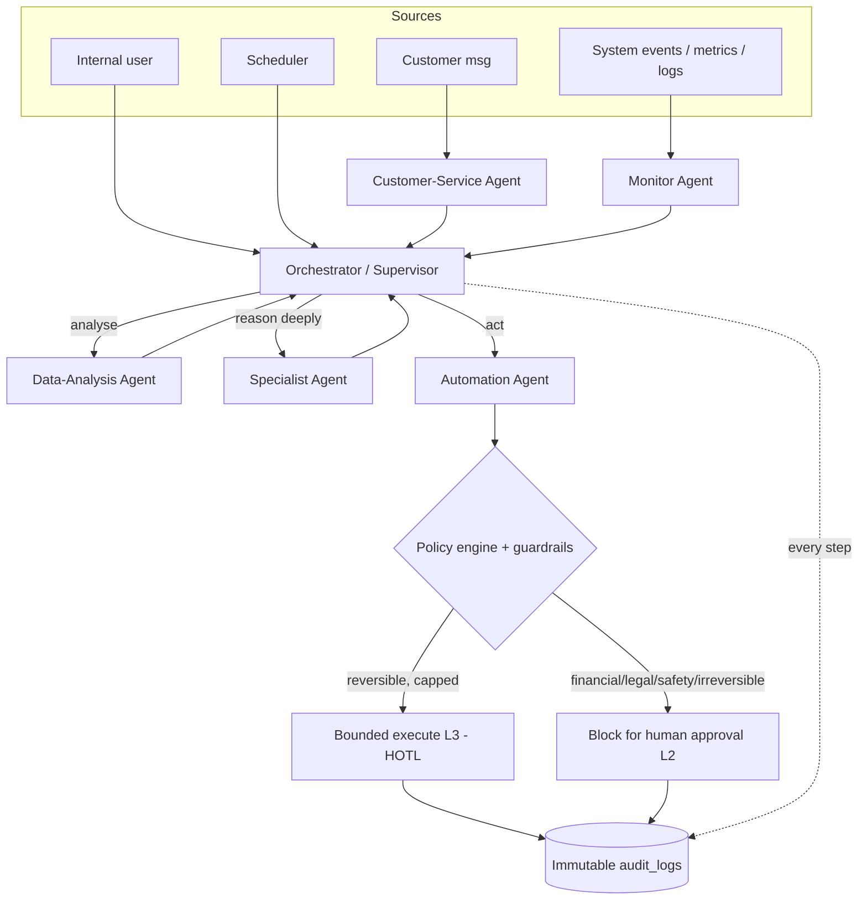

# Multi-Agent System Architecture — Mix Nova RMC

> Design for the **five-agent system** — Data-Analysis, Automation,
> Customer-Service, Monitor, and Specialist — working **together** as one
> supervised, tenant-isolated, fully-audited agentic layer over the RMC SaaS.
> It does not invent a new safety model: it **binds the five agents to the
> existing L0–L5 autonomy ladder and guardrail architecture**
> (`AUTONOMOUS_PRODUCT_BLUEPRINT.md`), routes their work to the worldwide
> capability corpus (`WORLDWIDE_RMC_REQUIREMENTS.md`), and reuses the platform
> foundations already built (RLS tenant isolation, RBAC, append-only audit, and
> the logs/alerts/metrics observability trio).
>
> **No implementation here** — this is the architecture + a testable requirements
> addendum (`WR-AGT-*`) and a dependency-aware phasing. Building starts only on a
> green-light, one agent and one tool at a time, per the blueprint's "add write
> tools one at a time, each behind policy" rule.

## 1. Why five agents, and the one rule that governs all of them

RMC operations decompose naturally into five distinct cognitive jobs — *analyse,
act, converse, watch, and reason-deeply* — that differ in risk, latency,
data-access, and the model tier they deserve. Splitting them into separate agents
with separate tool-scopes is itself a safety property: the agent that talks to
customers (untrusted input) is not the agent that can move money, and the agent
that watches the system cannot silently change it.

**The hard rule from the blueprint applies unchanged to every agent:**

> Financial, legal, safety-critical, and irreversible actions **never exceed L4
> and default to L2** (prepare-and-block-for-approval). Reversibility is the
> governing metric. No agent, and no combination of agents, is ever L5.

Everything below is an application of that rule, not an exception to it.

## 2. The five agents

Each agent has: a **mandate**, the **worldwide requirements it serves**, its
**triggers**, its **tool scope** (read/write, RBAC-gated), its **starting and
ceiling autonomy level**, a **model tier**, and its **guardrails**.

### 2.1 Data-Analysis Agent — "the analyst"

| Aspect | Design |
|---|---|
| **Mandate** | Turn the plant's operational + financial data into insight: KPIs, margin/leak analysis, yield & returned-concrete analysis, demand forecasting, cross-plant benchmarking, anomaly *explanation* (not action). |
| **Serves** | WR-FIN-1..5 (four-pool costing, margin-by-dimension, returned-concrete), WR-FIN-19 (BI/forecasting/benchmarking), WR-TEL-14 (KPI from phase durations), WR-STD-14 (statistical-acceptance trend/SD), WR-SUS-6 (carbon-intensity trends). |
| **Triggers** | Scheduled (nightly/period-close), on-demand (a user asks "why did plant B's margin drop?"), or handed a question by the Monitor/Specialist agents. |
| **Tools** | **Read-only** analytics tools: tenant-scoped SQL/reporting views, metrics store, forecast models. Emits reports, charts, narratives, and *proposed* alerts — never writes business data. |
| **Autonomy** | Start **L1** (compute + explain + recommend). Ceiling **L1→L2** (may auto-*open* an approval request or a drafted action for another agent; never auto-resolves). |
| **Model tier** | Opus/Sonnet for multi-step analytical reasoning; results cached. |
| **Guardrails** | Read-only tool set only; every figure carries **data lineage** (WR-TEL-14) back to source rows so a claim is auditable; no PII in outputs beyond role scope. |

### 2.2 Automation Agent — "the operator"

| Aspect | Design |
|---|---|
| **Mandate** | Execute *prepared, reversible* operational workflows: dispatch re-sequencing, reorder-point → draft purchase requisition, payment-reminder sending, auto-open approval requests, orchestrate batch mix-download & three-way reconciliation, pre-fill IRN/e-way payloads for human sign-off. |
| **Serves** | WR-TEL-13 (dispatch scheduling/optimization), WR-FIN-8 (reorder/procurement drafts), WR-BCI-7..12 (batch download/reconciliation orchestration), WR-TAX-2/10/12/13 (prepare-then-transmit clearance/e-way as bounded jobs *after* human sign-off), WR-COM-4/5 (reminders within consent). |
| **Triggers** | Event-driven (Monitor detects a reorder breach / a cleared invoice ready to transmit), scheduled (reminder runs within quiet-hours), or a Specialist/Data-Analysis recommendation promoted to an action. |
| **Tools** | **Write tools, allow-listed one at a time, each behind the policy engine.** Separated read vs write sets (blueprint §4.1). |
| **Autonomy** | Per-capability, from the blueprint's target table: reminders/dispatch-resequence/reorder-draft/maintenance-schedule → **L1→L3** (reversible, budget/quiet-hour capped, HOTL-abortable); anything touching **money / GST / IRN / e-way / contract / load accept-reject → hard L2** (prepare-and-block). |
| **Model tier** | Sonnet for routine orchestration; escalates to Specialist for hard decisions. |
| **Guardrails** | Every write passes the **policy engine → reversibility check → budget/rate/quiet-hour caps → HITL for irreversible** (blueprint §4 flowchart). Every proposal + decision + actor is written to the immutable `audit_logs`. Subject to the per-tenant **kill switch** and action/token budget. |

### 2.3 Customer-Service Agent — "the concierge"

| Aspect | Design |
|---|---|
| **Mandate** | The customer-facing conversational surface: answer "where's my truck?"/ETA, order status, invoice & payment queries, take/edit orders and quote requests, capture complaints, send proactive delivery/payment notifications. |
| **Serves** | WR-COM-1 (self-service ordering), WR-COM-2 (live tracking/ETA answers), WR-COM-3 (e-ticket/ePOD delivery), WR-COM-4 (payment/AR self-service), WR-COM-5 (omnichannel), WR-TEL-8 (ETA). |
| **Triggers** | Inbound customer message (WhatsApp/portal/SMS/email/voice) or an outbound event (truck loaded, status change, payment due). |
| **Tools** | Read tools for the customer's *own* order/delivery/invoice data (RLS-scoped **and** customer-scoped); write actions (place/edit order, request quote, initiate payment) are **prepared** and either auto-confirmed only when trivially reversible or routed through the Automation agent's L2 path. |
| **Autonomy** | Conversation + read answers **L1** (free). Order placement/edit **L2** (prepare → confirm). Outbound messaging **L3** only **within DLT/TCPA/GDPR consent + quiet hours + rate caps** (WR-COM-6). |
| **Model tier** | Sonnet (fast, conversational); Haiku for simple status lookups. |
| **Guardrails** | **This agent consumes untrusted input**, so it gets the strongest injection defenses: customer text is data, never instructions; a fixed tool allow-list it cannot expand; output-schema validation; no access to any tenant-internal or cross-customer data; consent-engine check before every outbound message; escalation-to-human path for anything it cannot safely resolve. |

### 2.4 Monitor Agent — "the watchtower"

| Aspect | Design |
|---|---|
| **Mandate** | Continuously watch the *system and the operation* and escalate: 5xx/error spikes, integration/controller/device health, plant/telematics heartbeats, and business-threshold breaches (calibration overdue, credit-limit/DSO spike, stockout risk, yield/tolerance out-of-spec, e-way/IRN failures, cold-joint spacing risk). Watches the **other four agents** too. |
| **Serves** | WR-PLT-7 (observability/SLOs/integration-health), WR-BCI-13 (controller heartbeat/stale-actuals), WR-TEL-4 (device health), WR-STD-12/13/14 (calibration/sampling/acceptance breaches), WR-FIN-15/19 (credit/DSO/exception alerting). |
| **Triggers** | Streaming (the shipped structured logs + Prometheus metrics + 5xx `ErrorAlertService`), scheduled sweeps, and thresholds. |
| **Tools** | **Read-only** over logs/metrics/traces/business views; its only "action" is to **raise an alert or open an approval/incident** — it never remediates directly (separation of duties: the watcher cannot change what it watches). |
| **Autonomy** | **L1→L2**: flag and auto-*open* a reversible approval/incident; hand remediation to the Automation or Specialist agent; never auto-resolves. |
| **Model tier** | Haiku (high-frequency, cheap) for triage; escalates a triaged incident to Specialist for root-cause. |
| **Guardrails** | Read-only; dedup/throttle/circuit-breaker reused from the shipped `ErrorAlertService` so a storm pages once; its escalations are audited; it cannot silence itself. |

### 2.5 Specialist Agent — "the expert council"

| Aspect | Design |
|---|---|
| **Mandate** | Deep, knowledge-intensive reasoning on the hard domains, invoked on demand as a **council of pluggable domain experts**: (a) **QC/standards** — mix-design conformance, statistical acceptance, durability limits, discharge/site-water rules; (b) **low-carbon/mix-optimization**; (c) **tax/compliance determination** across jurisdictions; (d) **batch-controller integration** troubleshooting; (e) **finance/costing** variance root-cause. |
| **Serves** | WR-STD-4/5/8/9/10/14/16/17 (mix design + QC + acceptance + durability), WR-SUS-1..4 (LCA/EPD + low-carbon), WR-TAX-5/11 (tax determination), WR-BCI-* (integration diagnosis), WR-FIN-3 (variance root-cause). |
| **Triggers** | Escalation from any other agent, or a user/QC-engineer request. |
| **Tools** | Read tools + domain knowledge/rule engines; produces **decision-support recommendations with citations to the standard/clause** — advisory by default. |
| **Autonomy** | **L1** advisory. Where it touches a mix design, load accept/reject, or compliance determination the ceiling is **hard L2** — a qualified human (QC engineer / tax owner) approves; the agent prepares and cites, it never attests. |
| **Model tier** | Opus (hardest reasoning), with structured, schema-validated outputs. |
| **Guardrails** | Advisory-only ceiling on safety/legal domains (blueprint hard rule); every recommendation cites its source clause (the corpus already flags all numeric thresholds for verification against the purchased standard edition); outputs schema-validated before another agent may act on them. |

## 3. Orchestration — how they work "together"

A **supervisor/orchestrator** pattern, not a free-for-all. One orchestrator owns
task intake, routing, shared context, and the guardrail funnel; the five agents
are workers with scoped tools.

**Interaction patterns:**
- **Event → watch → analyse → reason → prepare-act** (the main loop): Monitor
  detects a yield breach → Data-Analysis quantifies/attributes it → Specialist
  diagnoses (e.g. scale drift vs moisture) → Automation prepares the corrective
  action (open a calibration work-order draft) → human approves.
- **Request → converse → serve** (customer loop): Customer-Service handles the
  conversation, calls Data-Analysis for an ETA/insight if needed, and routes any
  order/payment write through the Automation L2 path.
- **Escalation chain**: any agent may escalate to Specialist (hard reasoning) or
  to a human (approval); nothing escalates *downward* into more autonomy.
- **Shared context / blackboard**: a tenant-scoped, task-scoped context store the
  orchestrator owns; agents read/write task state there, never each other's raw
  tool credentials.

## 4. Guardrails, isolation & safety (reusing what's built)

The multi-agent layer adds **no new trust in prompts**; it inherits the existing
enforcement points:

1. **Tenant isolation is non-negotiable and DB-enforced.** Every agent tool call
   runs inside `TenantDbService.runInTenant(tid, …)` so PostgreSQL RLS
   (`FORCE ROW LEVEL SECURITY`) makes cross-tenant access *impossible*, not merely
   discouraged. Platform-scope work (e.g. Monitor across tenants) uses the
   explicit `runAsPlatform(…)` path and is itself audited. An agent can never
   widen its own tenant scope.
2. **Least-privilege tool scoping (RBAC).** Each agent gets a named, allow-listed
   tool set mapped to RBAC permissions; read and write tools are separate sets;
   write tools are added **one at a time, each behind the policy engine**
   (blueprint §4.1). The tool-access matrix is the security contract:

   | Agent | Read business data | Raise alert / open approval | Write (prepared) | Send external message | Move money / GST / IRN / e-way |
   |---|---|---|---|---|---|
   | Data-Analysis | ✅ (scoped) | ✅ | ❌ | ❌ | ❌ |
   | Monitor | ✅ (logs/metrics/views) | ✅ | ❌ | ❌ | ❌ |
   | Customer-Service | ✅ (customer's own only) | ✅ | via Automation L2 | ✅ consent-gated | ❌ |
   | Specialist | ✅ (scoped) | ✅ | ❌ (advisory) | ❌ | ❌ |
   | Automation | ✅ (scoped) | ✅ | ✅ policy-gated | ✅ consent-gated | **L2 prepare-only** |

3. **The policy engine is the single funnel for every write** (blueprint §4):
   reversibility class → budget/rate/quiet-hour caps → HITL for
   financial/legal/safety/irreversible. No agent bypasses it.
4. **Immutable audit of agent actions.** Extend the append-only `audit_logs` to
   record, for every agent step: the proposal, the inputs, the policy decision,
   the model/agent identity, and the human actor on approval — doubling as DPDP
   and OWASP-agentic audit evidence.
5. **Kill switch + budget.** The per-tenant "pause all automation" switch and a
   token/action budget bound a runaway loop (the #1 agentic failure mode). Each
   agent also has a per-run step/tool-call cap.
6. **Prompt-injection & untrusted-input defense** (critical for Customer-Service,
   and for any agent reading customer text, ticket notes, or webhook payloads):
   external content is treated as **data, never instructions**; tool allow-lists
   are fixed and un-expandable at runtime; outputs are schema-validated; secrets
   never enter prompts; the agent cannot escalate its own privileges. This mirrors
   the repo's existing posture that external webhook/comment content is untrusted.
7. **Observability of the agents themselves.** Every agent run emits the same
   structured logs + Prometheus metrics already shipped (latency, tool-calls,
   token cost, outcome), so the Monitor agent — and humans — can watch the agentic
   layer with the exact tooling that watches the API. Agent errors flow through
   the shipped 5xx `ErrorAlertService` dedup/throttle path.

## 5. Requirements addendum (traceable `WR-AGT-*`)

Added to the worldwide corpus so the multi-agent system is first-class and
testable. Priority is the worldwide-product bar; all default to the blueprint's
hard rule.

| ID | Requirement (testable) | Pri | WHY |
|---|---|---|---|
| WR-AGT-1 | **Orchestrator/supervisor** routes tasks to the five agents with a tenant- & task-scoped shared context; no agent calls another's tools directly. | P1 | Deterministic routing + a single guardrail funnel; prevents uncontrolled agent-to-agent action. |
| WR-AGT-2 | **Every agent tool call runs inside `runInTenant` (or explicit audited `runAsPlatform`)**; a test proves an agent cannot read/write another tenant's rows. | P0 | Multi-tenant isolation is DB-enforced, not prompt-trusted. |
| WR-AGT-3 | **Per-agent allow-listed tool scope** (read/write separated) mapped to RBAC; an agent calling a tool outside its scope is rejected and audited. | P0 | Least privilege; the tool-access matrix is the security contract. |
| WR-AGT-4 | **All writes pass the policy engine** (reversibility → caps → HITL); financial/legal/safety/irreversible actions block at **L2**; a test proves an agent cannot auto-commit an invoice/IRN/e-way/payment. | P0 | The blueprint hard rule, enforced on agents. |
| WR-AGT-5 | **Immutable audit of every agent step** (proposal, inputs, decision, model/agent id, approver). | P1 | DPDP/OWASP evidence; dispute defense. |
| WR-AGT-6 | **Per-tenant kill switch + token/action budget + per-run step cap**; tripping any halts the agent cleanly. | P0 | Bounds runaway loops — the top agentic failure mode. |
| WR-AGT-7 | **Untrusted-input handling**: external text (customer/webhook/ticket) is data not instructions; fixed tool allow-list; schema-validated outputs; no secrets in prompts. | P0 | Prompt-injection defense, esp. Customer-Service. |
| WR-AGT-8 | **Consent-gated outbound messaging** (DLT/TCPA/GDPR + quiet hours + rate caps) before any agent-sent message. | P0 | Legal to message; ties to WR-COM-6. |
| WR-AGT-9 | **Agent observability**: each run emits structured logs + metrics (latency, tool-calls, tokens, outcome) and errors flow through the shipped alerter. | P1 | The Monitor agent and humans watch the agentic layer with the same tooling as the API. |
| WR-AGT-10 | **Specialist advisory ceiling**: recommendations on mix design / load accept-reject / compliance cite their source clause and require human approval to act. | P0 | Safety/legal attestation stays human (IS 4926 / GST). |
| WR-AGT-11 | **Model-tier routing** (Haiku triage → Sonnet routine → Opus deep) with graceful degradation and cost caps. | P2 | Cost/latency fit; no single-model lock-in. |
| WR-AGT-12 | **Human escalation path** from every agent for anything it cannot safely resolve. | P1 | Supervised autonomy; no silent wrong answers. |

## 6. Dependencies & phased rollout

Depends on foundations that are **present** (RLS isolation, RBAC, append-only
audit, observability trio) and some that are **not yet** (the shared integration
provider-registry/queue **GW-1**, live messaging + consent **GW-12**, the generic
`approval_requests` engine as the L2 substrate, and a policy engine). Rollout
follows the blueprint's "earn autonomy gradually" path — **read-only, low-risk
agents first**:

| Phase | Agents / scope | Autonomy | Gate to advance |
|---|---|---|---|
| **M0** | Guardrail substrate: orchestrator skeleton, tool-scoping, agent audit, kill switch/budget, policy-engine stub | — | Isolation + audit + kill-switch tests green |
| **M1** | **Monitor** + **Data-Analysis** (both read-only) | L1→L2 | Alerts/insights measured for precision; no writes |
| **M2** | **Specialist** (advisory) wired as escalation target | L1 (L2 ceiling) | Recommendations cite clauses; humans trust them |
| **M3** | **Customer-Service** read/answer + L2 order prepare; outbound messaging **only after** GW-12 consent engine | L1→L2/L3 | Consent + injection tests green |
| **M4** | **Automation** write actions, **one tool at a time**, each behind policy (reminders → reorder draft → dispatch re-sequence) | L1→L3 reversible only | Policy engine + rollback + per-tenant opt-in |
| **M5** | Assisted compliance: Automation prepares IRN/e-way/GSTR (**L2 human sign-off**), transmits as L3 retryable jobs *after* sign-off | L2→L3 | Live clearance integration (GW-2/3/4) stable |

**Never in scope** (unchanged from the blueprint): unattended plant operation,
auto-filing GST returns, auto-committing customer contracts, auto-issuing
invoices/IRN without sign-off, auto-accepting/rejecting a concrete load. No agent
is ever L5.

### 6.1 Build status — M0–M5 + LLM-1 shipped (merged to `main`)

The rollout above is now **built and merged**, each milestone verified against a
real Postgres 16 (unit + integration) and CI-green. M0–M5 are deterministic and
LLM-free — the guardrails are enforced in our code, not a model. **LLM-1** now
adds the reasoning layer *on top of* that same funnel: the model only *proposes*
tool calls; scope/policy/budget/tenant/audit still dispose. What lands here is the
*safe skeleton + reasoning harness*; only the live API key and the live external
calls remain the held owner/deployment portion (below).

| Milestone | Shipped | Where |
|---|---|---|
| **M0** | Guardrail substrate: kernel/orchestrator funnel, policy engine, tool registry (least-privilege), governor (kill switch + budgets), append-only run/step audit, all tenant-isolated (FORCE RLS). Diagnostics probe. | `apps/api/src/agents/*`, migration 19 |
| **M1** | **Data-Analysis** + **Monitor**, read-only (KPIs; overdue-AR/credit/low-stock alerts). | `data-analysis.agent.ts`, `monitor.agent.ts` |
| **M2** | **Specialist** advisory (cited compliance / AR-risk findings) + inter-agent **escalation** (least-privilege allow-list, depth guard, parent/child run linkage). | `specialist.agent.ts`, migration 20 |
| **M3** | **Customer-Service** — customer-scoped (two-layer: RLS + `customerId` filter), fixed-intent allow-list (untrusted-input seam). | `customer-service.agent.ts` |
| **M4** | **Automation** write-path + the **L2 approval substrate**: reversible write executes bounded (L3); financial/legal/irreversible is *prepared* as a `pending` approval a human decides once. | `automation.agent.ts`, `approval.service.ts`, migration 21, perm `agents.approve` |
| **M5** | Assisted compliance: Automation **prepares** India IRN / e-way payloads for approval (deterministic build, no transmission). | `compliance.util.ts`, `automation.agent.ts` |
| **LLM-1** | Reasoning layer: pluggable `LlmProvider` (Anthropic adapter, default `claude-opus-5`, adaptive thinking) behind graceful degradation; a bounded tool-use loop where the model *proposes* and the M0 funnel *disposes*; `ctx.reason()` + an `ask` run mode; `GET /agents/llm` + `POST /agents/:name/ask` (gated `agents.manage`); prompt-injection defense (data-not-instructions). The live key is held. | `agents/llm/*`, `agent-kernel.service.ts`, `agents.controller.ts` |

**Held for the owner/deployment portion** (deliberately *not* run in-sandbox): the
live **`ANTHROPIC_API_KEY`** (the LLM harness is built and unit/integration-tested
with a fake provider + the keyless degradation path; the real model call is
exercised by the owner post-deploy); live IRP/e-way **transmission** (GW-2/3/4);
outbound messaging + the **consent engine** (GW-12) that gates it; the shared
external provider-registry/queue backbone (GW-1); and the scale infra
(HA/PITR/secrets-vault, GW-16). Every M4/M5 write today is *prepare-and-block* —
an approved action's execution against a real external system is the next step,
taken with the owner before/at deployment.

The IRP/e-way live integration (GW-2/3/4) is now planned in deployment runbooks —
`docs/deployment/INTEGRATION-RUNBOOK-00-gst-common.md` (shared substrate: provider
abstraction, auth/encryption, the approval→execution step, secrets, idempotency,
rollback), `…-01-irp-einvoice.md` (IRN), `…-02-eway-bill.md` (e-way). They attach
to the *existing* M5 prepare-and-approve pipeline and the invoice columns that
already exist; only transmission + credentials remain owner-held.

## 7. Technology approach (framework-agnostic)

- **Models:** default to the latest, most capable Claude models, tiered by job —
  **Haiku** for high-frequency Monitor triage + simple Customer-Service lookups,
  **Sonnet** for conversational + routine Automation orchestration, **Opus** for
  Data-Analysis multi-step reasoning + the Specialist council. Tiering is a cost/
  latency decision (WR-AGT-11), not a capability lock-in; graceful degradation on
  provider error.
- **Agent runtime:** a tool-use loop (Anthropic API / Agent SDK-style) with
  structured/schema-validated outputs so a downstream agent or the policy engine
  consumes typed results, not free text. The design is runtime-agnostic — the
  guardrails (§4) are enforced in *our* code (tenant context, policy engine,
  audit, kill switch), never delegated to the model.
- **Integration substrate:** all external actions (messaging, clearance, payment,
  controller, telematics) go through the shared provider-registry + async queue +
  webhooks backbone (**GW-1 / WR-PLT-3**), so agents call *internal capabilities*,
  not third-party APIs directly.

## 8. Risks & honest positioning

- **Biggest risk is over-trust.** The mitigation is architectural, not
  aspirational: read-only agents first, write tools one-at-a-time behind a policy
  engine, hard-L2 on anything financial/legal/safety, kill switch + budget, and
  full audit. The multi-agent layer makes the product *faster to operate*, not
  *unsupervised*.
- **Prompt injection via customer channels** is the sharpest new attack surface;
  §4.6 + WR-AGT-7 address it, and the Customer-Service agent is deliberately the
  *least* privileged.
- **Honest claim** (consistent with the blueprint): *"a team of specialised
  assistants that watch, analyse, converse, and prepare the work — enforcing the
  guardrails so your people approve rather than key — never an unattended
  autopilot over money, compliance, or concrete quality."*

> Cross-references: `AUTONOMOUS_PRODUCT_BLUEPRINT.md` (L0–L5 ladder + guardrail
> architecture this doc binds to), `WORLDWIDE_RMC_REQUIREMENTS.md` (the WR-*
> capabilities each agent serves; this doc adds `WR-AGT-*`),
> `WORLDWIDE_GAP_DELTA.md` (GW-1 backbone + GW-12 consent are prerequisites),
> `SECURITY_PRIVACY_THREAT_MODEL.md` (isolation/injection posture).
