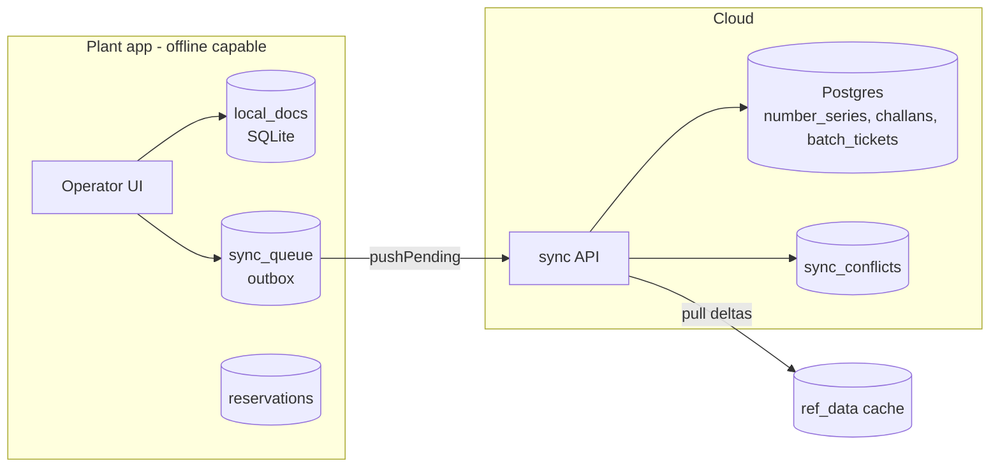
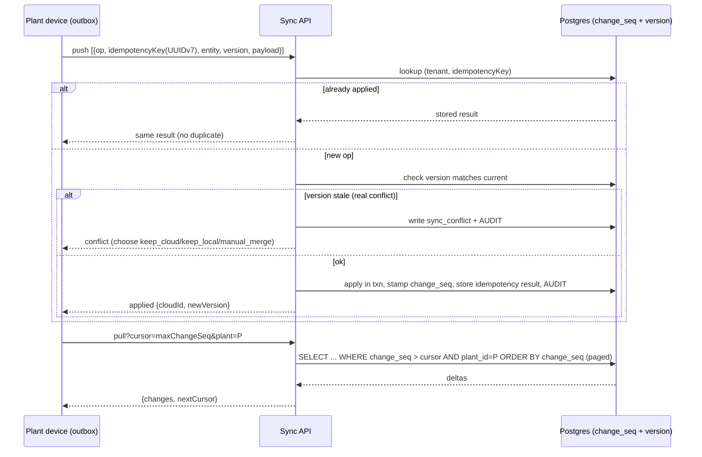

# Offline-Sync & Conflict-Resolution Strategy — Mix Nova RMC

> Why offline matters here, exactly what is built today, the concrete
> correctness bugs in the current sync protocol, and the target strategy that
> keeps the good parts (reserved numbering, DB-backed idempotency) while fixing
> the fragile cursor and closing the coverage gap. Research-backed; no
> implementation in this document.

## 1. Why offline is not optional for RMC

An RMC plant runs a **90-minute clock**: once mixing water is added, the concrete
must be discharged within 90 minutes or 300 drum revolutions (IS 4926). Plants
sit at quarries, highways, and greenfield sites with **unreliable connectivity**.
Batching, delivery-challan generation, and weighbridge capture are therefore
**time-critical and cannot pause for the internet**. The correct architecture is
**local-first capture with store-and-forward sync**, deferring only the things
that are genuinely online-only (IRN generation, e-way bill, cross-plant reports).
This is a real Indian-market differentiator — several competitors advertise an
"offline mode" precisely for this reason.

## 2. What is built today (verified)

There is a **real, tested offline MVP** — this is not vaporware.

**Server (`apps/api/src/sync/`):** a NestJS module gated by module `offline_sync`
and permission `sync.manage`, exposing device register, a bootstrap snapshot,
number-reservation, `push`, `pull`, and conflict list/resolve.

**Plant app (`apps/plant-app/`, Electron + `node:sqlite`):** a local store with a
real **outbox** (`sync_queue` with `sync_status`, `retry_count`, `last_error`),
reserved-number consumption, offline challan/batch creation, `pushPending`, and
`pull`. A self-test (`selftest.js`) drives the full cycle —
register → bootstrap → reserve → offline entry → push → **idempotent re-push** →
pull → conflict → resolve — against a live API.

**Genuine strengths to preserve:**
- **Reserved and online numbers cannot collide.** Both draw from the same
  `number_series` row under `SELECT … FOR UPDATE` (reservation in
  `sync.service.ts`, online allocation in `numbering.service.ts`). This solves the
  hardest statutory-numbering problem correctly.
- **Create-idempotency is backed by real DB unique constraints**
  (`uq_delivery_challans_no`, `uq_batch_tickets_no`), so a retried create returns
  the existing row instead of double-inserting.

## 3. What is NOT built (delta vs DESIGN-DOC-08)

| Design promise (§) | Reality |
|---|---|
| Offline queue for dispatch update, material inward, weighbridge, stock txns, negative-stock (§36) | **Only 3 ops built**: create challan, create batch ticket, update challan. Everything else → `unsupported_entity` conflict. |
| Version-based conflict detection (§15) | **Wall-clock `updatedAt` string compare only.** No `@VersionColumn` anywhere. |
| Resolution: `manual_merge`, `cancel_local_transaction` (§16) | Only `keep_cloud` / `keep_local`; `keep_local` re-applies **challans only**. |
| Mandatory conflict **audit** (§16.4) | Not logged — `SyncService` has no `AuditService`. |
| Retry schedule 1/5/15/30 min (§26) | `retry_count`/`last_error` columns exist but are **never used**; no scheduler/backoff. |
| Sync-run log table (§33), local backup (§27), offline audit logs (§30) | **None built.** |
| Offline login, cached credentials, 3-day expiry, encrypted local DB (§29) | App takes a **pasted access token** stored in an **unencrypted** SQLite file. |
| Device activate/deactivate/revoke/force-logout (§31) | Web page is read-only; endpoints check the device **exists**, never `status==='active'`. |
| Cache "assigned plant only, ±7 days" (§9.2) | Bootstrap & pull are **tenant-wide** with a hard `take:500` and **no plant filter**. |

## 4. Correctness bugs in the current protocol (must-fix before scaling offline)

These are not style issues — they can **lose or duplicate plant data**.

### BUG-1 — Wall-clock cursor loses updates (HIGH)
`pull` uses `updatedAt: MoreThan(since)` where `since` is a server
`new Date()` captured before the query runs. Two failure modes:
- A row whose `updatedAt` **equals** the token is excluded this round (`> since`)
  **and** next round (next `since` = the same token) → **permanently skipped**.
- Rows committed with `updatedAt ≤ token` but made **visible after** the query
  (commit-vs-clock ordering, or same-millisecond writes) are **silently missed**.
There is no monotonic version/LSN and no overlap window to recover them. On a
multi-writer tenant this is a real lost-update path.

### BUG-2 — Retried successful UPDATE becomes a spurious conflict (HIGH)
After an update applies, the cloud's `updatedAt` advances. If the outbox retries
the same update (its `baseUpdatedAt` is now stale — e.g. the success response was
lost), the server records a `stale_update` conflict even though nothing actually
conflicted. The operator is then asked to resolve a non-conflict, and a wrong
`keep_local` re-applies stale data.

### BUG-3 — No client clock discipline (MEDIUM)
Offline record timestamps derive from the sync token / a `_clock` meta hack, not
a trusted device clock. Since the whole conflict model rests on timestamps,
offline ordering is unreliable.

### BUG-4 — Silent 500-row truncation, tenant-wide (HIGH for real plants)
Bootstrap and pull cap at `take:500` with no pagination and no plant scoping. A
plant with >500 customers/orders/changed rows gets a **silently incomplete**
local cache — the opposite of what an offline plant needs.

### BUG-5 — No device credential; revocation unenforceable (SECURITY)
All sync endpoints authenticate with the **user's JWT** and take `deviceId` as a
plain parameter. Any user with `sync.manage` can push/pull as **any** device, and
a deactivated device keeps syncing. The pasted bearer token lives unencrypted on
the plant PC.

## 5. Target strategy

The research is unambiguous for this data class: **event-sourced /
server-authoritative writes with idempotency keys — never last-write-wins for
money or inventory.** LWW is acceptable only for cosmetic fields (a driver's
free-text note). The target keeps the two things the current build gets right
(reserved numbering, DB-backed idempotency) and replaces the fragile cursor.

### 5.1 Cursor: monotonic change-feed, not wall-clock
Replace `updatedAt > since` with a **monotonic per-row sequence**. Options, in
increasing robustness:
- A `bigint` **sequence column** (`change_seq`) stamped by a trigger/`DEFAULT
  nextval` on every insert/update of syncable tables; pull uses
  `change_seq > cursor ORDER BY change_seq` and the client stores the max
  `change_seq` seen. Monotonic, gap-tolerant, no clock dependency.
- Or a dedicated **outbox/change-log table** per tenant (append-only) that the
  server writes in the same transaction as the business change — the canonical
  event-sourcing shape, and it doubles as the sync-run/audit log the design asks
  for.

### 5.2 Idempotency: explicit key on every operation
Every queued client operation carries a stable **UUIDv7 idempotency key** sent as
an `Idempotency-Key`; the server stores `(tenant_id, idempotency_key) → result`
and returns the **same** result on replay. This makes BUG-2 impossible: a retried
update is recognised as the same operation, not a conflict. Keep the DB unique
constraints as the second line of defence.

### 5.3 Optimistic concurrency: a real version column
Add `@VersionColumn` (`version int`) to every syncable business entity. Conflict
detection compares `version`, not a timestamp string. A genuine concurrent edit
(two devices, same challan) is then unambiguous and can offer `keep_cloud` /
`keep_local` / **`manual_merge`** with a **mandatory audit entry**.

### 5.4 Conflict policy by data class
| Data class | Policy |
|---|---|
| Inventory movements, batch tickets, dispatch, invoices, receipts | **Server-authoritative, append-only ops + idempotency.** No silent overwrite; genuine conflicts surface to an authorised human (Owner/Admin/Plant Manager) and are audit-logged. |
| Reserved document numbers | Cloud-issued blocks (already correct); never mint an unreserved offline number. |
| Cosmetic free-text (notes, remarks) | LWW acceptable. |

### 5.5 Scope & security
- **Plant-scoped, paginated** bootstrap/pull (fix BUG-4): filter by the device's
  plant, page with the change-feed cursor, no silent cap.
- **Per-device credential** (fix BUG-5): issue a device token at registration;
  enforce `status==='active'` on every sync call; support revoke/force-logout.
- **Encrypt the local SQLite** and move from a pasted bearer to a proper offline
  login with a bounded (e.g. 3-day) cached-credential expiry, per design §29.

### 5.6 Build-vs-buy
Two credible paths (decision recorded in `ARCHITECTURE_DECISION_REGISTER.md`):
- **Evolve the custom outbox** — lowest disruption, keeps the Electron app and
  the reserved-numbering logic; add change-feed + idempotency + version columns +
  the missing ops. Best if offline breadth stays modest.
- **Adopt PowerSync** (Postgres ↔ client SQLite, **writes routed back through the
  existing NestJS API** so RLS and business rules stay authoritative) — best if
  offline coverage must expand to most entities and large local datasets. It
  removes the need to hand-roll the change-feed and retry engine.

Both must keep an **explicit idempotency-key contract** so batch/dispatch replays
are safe regardless of tool.

## 6. Target sync sequence (with the fixes)

## 7. Priority order (feeds the roadmap)

1. **Fix the cursor (BUG-1) and add idempotency keys (BUG-2)** — these threaten
   data integrity and are prerequisites for trusting offline at all.
2. **Plant-scope + paginate bootstrap/pull (BUG-4).**
3. **Device credential + revocation enforcement + local encryption (BUG-5).**
4. **Extend coverage** to inward/weighbridge/dispatch-update/stock (the ops the
   plant actually needs offline).
5. **Add version columns, `manual_merge`, and conflict audit.**
6. **Retry/backoff, sync-run log, local backup** (operational polish).

Until items 1–2 are done, offline should be positioned to the owner as a
**demonstrable MVP for challans/batch tickets**, not as production-grade offline
for the whole plant.
