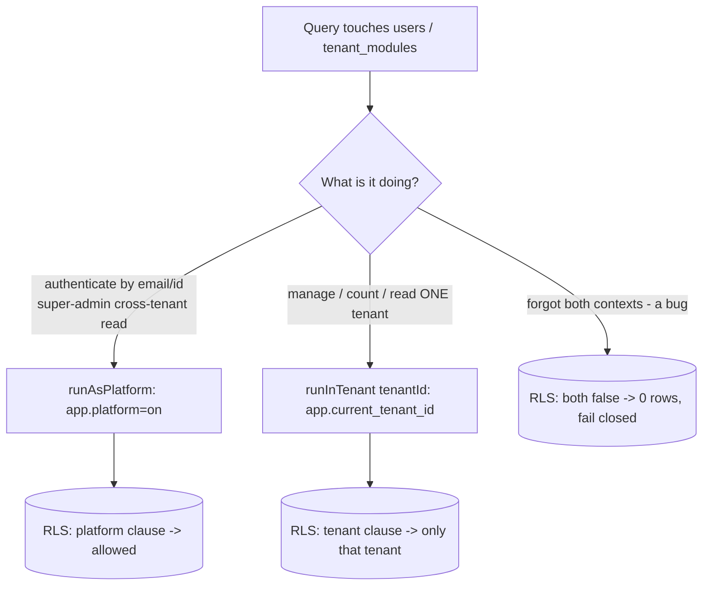

# Design: Row-Level Security for `users` and `tenant_modules`

> Closes gap **G9 / R5** from the audit — the two tables that carry a `tenant_id`
> but are **not** protected by RLS, so their tenant isolation is enforced only by
> application code. This document is the deliberate design pass the audit and the
> threat model flagged as **human-in-the-loop**, because a naive policy on
> `users` breaks authentication. Nothing here is implemented yet — it is the
> spec + risk assessment for review before touching the auth path.
>
> Companion: `SECURITY_PRIVACY_THREAT_MODEL.md` (§2 tenant-isolation guarantee),
> `AS_IS_SYSTEM_ARCHITECTURE.md` (§6 data model gaps).

## 1. Goal and the core tension

Every other tenant table enforces isolation at the **database** via
`FORCE ROW LEVEL SECURITY` keyed on the transaction-local GUC
`app.current_tenant_id`. `users` and `tenant_modules` do not, so a future code
path that queried them without a tenant filter would **fail open** (leak across
tenants) instead of fail closed.

The reason `users` was left out is real: **authentication is inherently
tenant-agnostic.** At login you look a user up **by email before you know their
tenant**; on refresh/`me`/change-password you look them up **by id**; and
**platform super-admins have `tenant_id = NULL`**. A policy of
`tenant_id = current_setting('app.current_tenant_id', true)::uuid` would return
**zero rows** for all of these (unset GUC → `NULL`; and `NULL = <uuid>` is never
true), so **login would break for everyone and super-admins would be invisible.**

The design must therefore give the database a way to distinguish two legitimate
access patterns:

- **Tenant-scoped** — "manage the users of *my* tenant" (list, create, count,
  deactivate). Should be confined to one tenant.
- **Identity / platform** — "authenticate this person" and "super-admin
  administers users across tenants". Genuinely cross-tenant.

## 2. Access-site map (verified)

Every place `users` / `tenant_modules` is touched today, and the DB context it
runs in (plain connection = no tenant GUC set).

| Site | Table | Access | Context today | Correct scope |
|---|---|---|---|---|
| `auth.service` login (by email) + `lastLoginAt` update | users | R + U | plain | **identity** (tenant unknown) |
| `auth.service` refresh (by id) | users | R | plain | **identity** |
| `auth.service` me (by id) | users | R | plain | **identity** |
| `auth.service` change-password (by id) + hash update | users | R + U | plain | **identity** |
| `plan-limits.countUsers(tenantId)` | users | R | plain (filtered by tenantId) | tenant-scoped |
| `setup.services` user create / role-change / reset / deactivate | users | R + W | plain (app-checked tenantId) | tenant-scoped |
| `platform.service` first-user bootstrap | users | W | plain / target tenant | target-tenant-scoped |
| `platform.service` list a tenant's users | users | R | plain | target-tenant-scoped |
| `platform.service` data export (strips password_hash) | users | R | `runInTenant(target)` already | tenant-scoped ✔ |
| `tenant-access.entitlements(tenantId)` | tenant_modules | R | plain (guard-time, filtered) | tenant-scoped |
| `auth.service` loadModules → entitlements | tenant_modules | R | plain | tenant-scoped |
| `platform.service` list all enabled modules | tenant_modules | R | plain | **platform** (cross-tenant) |
| `platform.service` toggle a tenant's module | tenant_modules | R + W | plain | target-tenant-scoped |

**Reading:** only the **4 auth identity reads** (+ their 2 updates) and **1
platform aggregate read** are genuinely cross-tenant. Everything else is really
*one specific tenant* and can simply run under that tenant's GUC.

## 3. Recommended design

**Two contexts, a fail-closed policy, and a tiny trusted surface.**

### 3.1 The policy (identical on both tables)

```sql
ALTER TABLE users ENABLE ROW LEVEL SECURITY;
ALTER TABLE users FORCE ROW LEVEL SECURITY;
CREATE POLICY users_isolation ON users
  USING (
        tenant_id = current_setting('app.current_tenant_id', true)::uuid
     OR current_setting('app.platform', true) = 'on'
  )
  WITH CHECK (
        tenant_id = current_setting('app.current_tenant_id', true)::uuid
     OR current_setting('app.platform', true) = 'on'
  );
CREATE INDEX IF NOT EXISTS idx_users_tenant ON users (tenant_id);
-- identical policy + index on tenant_modules
```

- **Default is fail-closed.** With neither GUC set, both clauses are false → a
  `users` query returns **nothing**. So a future bug that forgets both contexts
  leaks *nothing* instead of *everything* — the whole point of the change.
- **Tenant clause** scopes normal reads to one tenant, exactly like the other 51
  tables.
- **Platform clause** (`app.platform = 'on'`) is the explicit, auditable opt-in
  for the handful of identity/platform paths. `NULL`-tenant super-admin rows are
  visible **only** under this clause.

### 3.2 Two helpers on `TenantDbService`

`runInTenant(tenantId, work)` already exists (sets `app.current_tenant_id`
transaction-locally). Add its sibling:

```ts
/**
 * Run work in an UNSCOPED, cross-tenant context — ONLY for authentication
 * (identity lookup by email/id, before the tenant is known) and super-admin
 * platform administration. Sets app.platform='on' transaction-locally. Every
 * caller is security-sensitive and must be reviewed; there are only a few.
 */
runAsPlatform<T>(work: (m: EntityManager) => Promise<T>): Promise<T> {
  return this.dataSource.transaction(async (m) => {
    await m.query(`SELECT set_config('app.platform', 'on', true)`);
    return work(m);
  });
}
```

The trusted surface is then a **grep-able allow-list**: every `runAsPlatform`
call site is a place we consciously permit cross-tenant access.

### 3.3 Decision flow



## 4. Per-site changes

| Site | Change |
|---|---|
| `auth.service` login / refresh / me / change-password | Wrap the user read (+ any update) in **`runAsPlatform`**. Identity lookups + `lastLoginAt`/password updates then satisfy the platform clause. |
| `plan-limits.countUsers` | Move the count into **`runInTenant(tenantId)`** (drop the `this.ds` plain read). It's already filtered by tenantId, so the result is unchanged; it just becomes DB-enforced. |
| `setup.services` user create / role-change / reset / deactivate | Wrap each in **`runInTenant(tenantId)`** (the operator's tenant). New-user `WITH CHECK` passes because the row's `tenant_id` = the operator's tenant — which also **prevents a bug from ever writing another tenant's user**. |
| `platform.service` first-user bootstrap / list one tenant's users / toggle module | Use **`runInTenant(targetTenantId)`** — target-scoped, and more correct than the current unscoped access. |
| `platform.service` list **all** enabled modules (cross-tenant aggregate) | Use **`runAsPlatform`**. |
| `tenant-access.entitlements` | Wrap the `tenants` + `tenant_modules` reads in **`runInTenant(tenantId)`** (the id comes from the verified JWT). `tenants` has no RLS so it's unaffected; `tenant_modules` is now scoped. This runs at guard time in its own short transaction and is cached (30 s TTL), so the cost is negligible. |
| `platform.service` data export | No change — already `runInTenant(target)`. |

**Grant note:** `rmc_app` keeps `SELECT/INSERT/UPDATE` on `users` (no DELETE) and
its `tenant_modules` grants — RLS narrows *which rows*, not the privileges.

## 5. Migration

`1720000018000-UsersTenantModulesRls` (additive, reversible):

```
up:   ENABLE + FORCE RLS + the policy + idx on users and tenant_modules
down: DROP POLICY + DISABLE RLS on both
```

No data migration — the policy governs access, not stored rows. Because
`app.current_tenant_id` uses `missing_ok = true`, the policy is safe on a
connection that never sets it (returns NULL → fail-closed), so **the migration
can land before the code changes without breaking reads that already run under
`runInTenant`** — but the auth paths (plain-connection reads) MUST be converted
to `runAsPlatform` in the **same deploy**, or login breaks. Ship the migration
and the code changes together.

## 6. Alternatives considered (and why not)

| Alternative | Verdict |
|---|---|
| Naive `tenant_id = GUC` policy | ✗ Breaks login, refresh, and hides super-admins. |
| Permissive when no context (`GUC IS NULL OR tenant_id = GUC`) | ✗ No real gain — a context-less query still sees everything (fails open). |
| Give `rmc_app` `BYPASSRLS` for auth | ✗ Destroys the security model (the whole point is a non-bypass app role). |
| A separate DB role for auth with its own policy | ✗ Heavier (two pools, two credentials); `runAsPlatform` gets the same isolation with far less machinery. |
| Leave it app-enforced (status quo) | Tenable, but keeps the fail-**open** default the audit flagged. The recommended design makes it fail-**closed** for a small, auditable cost. |

## 7. Risk, rollout, verification

**Blast radius: high** — it touches the authentication path, the single most
critical flow. That is why this is a reviewed design, not an autopilot change.
**Mitigating factor:** the auth path now has strong automated coverage, so a
regression fails loudly rather than silently.

**Rollout (staging-first):**
1. Land migration + code changes together on a branch.
2. Full suite must pass in CI (see below).
3. Deploy to **staging**, smoke-test real logins (tenant user + super-admin),
   refresh, change-password, user management, plan-limit counting, module gating.
4. Then production, with the pre-redeploy backup (migration is reversible; the
   code is a normal rollback).

**Verification — existing tests already exercise the risk:**
- `rls-isolation.test.mjs` — extend: assert a `users` read with **no context**
  returns 0 (fail-closed), and cross-tenant user read = 0.
- `run-integration` boots + **creates a tenant + owner + logs in** — breaks
  immediately if `runAsPlatform` is missing on login.
- `refresh-rotation.test.mjs`, `cookie-auth.test.mjs` — exercise login / refresh
  / change-password / logout end-to-end.
- e2e Suite B — logs in as **multiple tenant users + a super-admin**, and checks
  module gating (tenant_modules) and RBAC.
- **New tests to add:** super-admin login succeeds; a tenant admin listing users
  sees only their own tenant's users; `plan-usage` seat count unchanged.

**Definition of done:** all of the above green locally + in CI, and the staging
smoke-test checklist passed, before production.

## 8. Recommendation

**Proceed** — the design is sound and turns the last two app-enforced tables into
DB-enforced, fail-closed ones with a **minimal, grep-able trusted surface**
(`runAsPlatform` at ~5 sites, all in auth/platform). Implement it as a single
reviewed change (migration + the per-site wraps + the new tests), verify against
the full suite, and **deploy staging-first** given it touches login.

Because it modifies authentication and cannot be validated against live data from
a sandbox, the implementation should be reviewed and released deliberately — not
folded silently into an unrelated change. When you approve this approach, the
implementation is fully specified above and I can carry it out behind the test
net.
