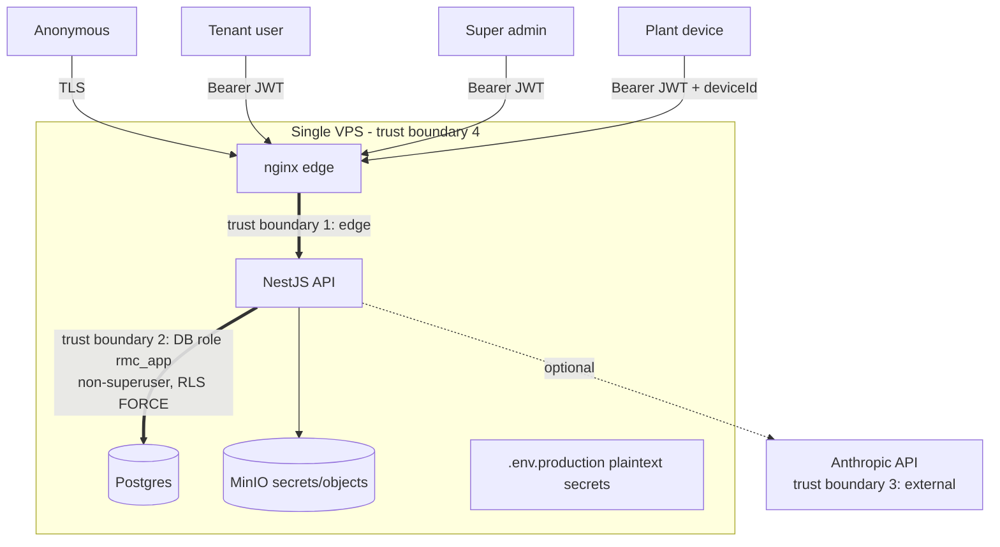

# Security & Privacy Threat Model — Mix Nova RMC

> STRIDE-based threat model for the multi-tenant SaaS, the tenant-isolation
> guarantee, India DPDP Act 2023 obligations, and a prioritised mitigation
> backlog. Scored against OWASP ASVS 5.0 Level 2 as the target. Findings are
> evidence-anchored to the As-Is audit; no changes are made in this document.

## 1. Assets, actors, trust boundaries

**Assets:** tenant business data (customers, orders, invoices, receipts,
outstanding — commercially sensitive and PII-bearing), auth credentials &
tokens, audit trail, DB/JWT/S3 secrets, the tenant-isolation guarantee itself.

**Actors:** anonymous internet, authenticated tenant user (12 roles), tenant
Company-Owner, platform super-admin, plant device (offline app), the AI
assistant (read-only), an attacker with XSS foothold, an attacker with host
access.

The **critical boundary is boundary 2**: even a fully compromised application
process connects as `rmc_app`, which cannot bypass RLS, cannot disable RLS, and
cannot `SET ROLE` to the owner. This is the system's strongest security property.

## 2. Tenant-isolation guarantee (what we can and cannot promise)

**Can promise (DB-enforced, test-proven):**
- Every one of 51 tenant tables has `ENABLE` + `FORCE ROW LEVEL SECURITY` and a
  `tenant_isolation` policy with **both** `USING` (reads) and `WITH CHECK`
  (writes), keyed on a transaction-local GUC set only from the JWT `tid`.
- The app role is non-superuser, non-`BYPASSRLS`; missing GUC **fails closed**.
- CI (`rls-isolation.test.mjs`) asserts: role not superuser, no bypass, no
  context → 0 rows, cross-tenant read = 0, cross-tenant insert refused, cannot
  disable RLS, cannot `SET ROLE` owner. The owner has also probed this live.

**Cannot fully promise (app-enforced only):**
- **`users` and `tenant_modules` have no RLS.** Cross-tenant safety there depends
  on application query hygiene, not the database. A future code path that queries
  `users` without a tenant filter would cross tenants. (Mitigation: add RLS or a
  DB-level tenant guard to these two tables.)
- **FKs are single-column (`id`), not `(tenant_id, id)`** — RLS is the only thing
  stopping a child row from referencing another tenant's parent. Defense-in-depth
  gap, not an exploited hole (you cannot discover another tenant's UUIDs).
- The owner's RLS bypass **depends on `POSTGRES_USER` actually being a
  superuser**; this is an implicit, undocumented deployment assumption.

## 3. STRIDE analysis

| # | Threat (STRIDE) | Vector | Current control | Residual | Sev |
|---|---|---|---|---|---|
| S1 | **Spoofing** — forge a JWT | Weak default secrets `change-me-access/refresh` can boot in prod (`auth.service.ts:10-11`) | Separate access/refresh secrets *if set* | If env vars are forgotten, tokens are forgeable | **High** |
| S2 | Spoofing — sync as another device | `deviceId` is a plain param; any `sync.manage` user acts as any device | User JWT required | No per-device credential | Med |
| T1 | **Tampering** — rewrite audit trail | — | `audit_logs` granted only `SELECT,INSERT`; append-only by privilege | Very low (strong) | Low |
| T2 | Tampering — negative money/qty, invalid status | Direct write with bad values | App-layer validation (partial) | **No DB CHECK constraints**; DB accepts negatives/invalid status | Med |
| R1 | **Repudiation** — deny an action | — | Audit captures actor/IP/action with redaction | Conflict-resolution & some writes unaudited | Med |
| I1 | **Info disclosure** — XSS steals tokens | `localStorage` holds access **and** refresh tokens | CSP `connect-src` limits exfiltration; refresh caught behind... | `script-src 'unsafe-inline'/'unsafe-eval'`; refresh token = long-lived theft | **High** |
| I2 | Info disclosure — cross-tenant read | Missing tenant filter / IDOR | RLS FORCE on business tables; IDs non-enumerable | `users`/`tenant_modules` not RLS-covered | Med |
| I3 | Info disclosure — 5xx leaks DB text | Error responses | Global filter summarises 5xx to "Something went wrong", logs full server-side | Low | Low |
| I4 | Info disclosure — secrets at rest | Host compromise | `.env` git-ignored, `umask 077` backups, secret redaction in audit | **Plaintext secrets on host; no vault; no rotation; no at-rest encryption** | **High** |
| D1 | **DoS** — auth brute force / floods | — | Global throttle 100/60s; login 5/60s; fail2ban script | App-layer only; **no edge WAF**; single box | Med |
| D2 | DoS — resource exhaustion on 4 GB box | Large uploads / load | 25 MB body cap; container healthchecks | No autoscaling; no HA; a spike can take the whole service down | Med |
| E1 | **Elevation** — app process → cross-tenant | RCE/logic bug in API | `rmc_app` non-superuser, no bypass, RLS FORCE | Strong; bounded to app-enforced tables (I2) | Low |
| E2 | Elevation — ungated write endpoints | Any tenant user | Most controllers permission-gated | **production-plans & mix-design create/edit ungated**; unprovisioned-tenant **fail-open** on modules/limits | Med |
| E3 | Elevation — no refresh rotation | Leaked refresh token | 14-day refresh, re-checks user/tenant active | **No rotation, no revocation, no blocklist** — leak is valid 14 days | Med |

## 4. Privacy / DPDP Act 2023 (India)

The product is a **Data Fiduciary** (and a **Data Processor** on behalf of each
RMC-company tenant) processing PII of drivers, employees, and customer contacts.
The DPDP **Rules 2025 were notified Nov 2025**, with substantive obligations due
~May 2027. Obligation-by-obligation status:

| DPDP obligation | Status today | Gap |
|---|---|---|
| **Rule 6 safeguards** — encryption, masking/tokenisation, RBAC, logging/monitoring, incident response | PARTIAL | RBAC ✅, audit logging ✅, TLS in transit ✅; **encryption at rest ❌, secrets vault ❌, no monitoring/alerting pipeline for security events**. |
| **Consent + notice** for personal data | MISSING | No consent/notice capture flow. |
| **Rule 7 breach notification** — affected principals "without delay", DP Board detailed within 72 h of awareness | MISSING | No breach-response runbook; no way to identify affected principals per tenant quickly. |
| **Data Processing Agreement** with each tenant | MISSING (contractual) | Tenant isolation should be a **contractual** guarantee mapping to Rule 6. |
| Data-principal rights (access, correction, erasure) | PARTIAL | Tenant data export exists; per-**individual** access/erasure not modelled. |
| Retention limits (GST 6-8 yr, audit 7 yr) | DOC-ONLY | Stated, not enforced. |

**Penalty exposure** is material: up to ₹250 cr for inadequate safeguards, ₹200 cr
for breach-notification failure. Isolation and audit are the two controls already
in good shape; consent, breach response, at-rest encryption, and secrets
management are the DPDP gaps.

## 5. OWASP ASVS 5.0 — target Level 2, current standing

| ASVS area | Standing | Notes |
|---|---|---|
| V1 Architecture, tenant isolation | **Strong** | DB-enforced RLS to the safe standard. |
| V2 Authentication | **Partial** | bcrypt cost 10, uniform login errors (no enumeration), rate-limited — but weak default secrets, no MFA, no refresh rotation. |
| V3 Session management | **Weak** | localStorage tokens, no rotation/revocation, sessions survive password change. |
| V4 Access control | **Partial** | RBAC + SoD real; a few ungated endpoints, fail-open provisioning. |
| V5 Validation / encoding | **Partial** | Global `whitelist` pipe; most business validation hand-rolled; no DB CHECKs. |
| V7 Error handling & logging | **Good** | Envelope + 5xx summarisation + append-only audit + secret redaction. |
| V6/V9 Cryptography, secrets | **Weak** | No vault, plaintext env secrets, no at-rest encryption, no rotation. |
| V10 Config / headers | **Partial** | nginx TLS/HSTS good; **API responses lack Helmet**; CSP allows `unsafe-inline`/`unsafe-eval`. |

## 6. Prioritised mitigation backlog

**P0 — do before widening the pilot / onboarding a second real tenant**
1. **Fail the boot if JWT secrets are defaults/empty** (S1). One guard clause;
   removes a catastrophic token-forgery path.
2. **Move tokens to httpOnly/Secure/SameSite cookies + CSRF tokens, or at minimum
   stop storing the refresh token in localStorage** (I1). This is the single
   biggest web-security win; the code already documents the deferral.
3. **Add a secrets manager (or at least sops/age-encrypted env) + a rotation
   runbook** (I4); enable Postgres/MinIO encryption at rest.

**P1 — before scale**
4. **Refresh-token rotation + reuse detection + revocation list** (E3).
5. **Close the ungated write endpoints** (production-plans, mix-design
   create/edit) and **fail *closed* on unprovisioned tenants** (E2).
6. **Add RLS (or a DB tenant guard) to `users` and `tenant_modules`**, and move
   FKs to `(tenant_id, id)` where practical (I2).
7. **Add DB CHECK constraints** (non-negative money/qty; status enums) (T2).
8. **Add Helmet to the API** and tighten CSP off `unsafe-inline`/`unsafe-eval`
   where hydration allows.
9. **Edge rate-limiting / basic WAF** and verify fail2ban is actually installed
   on the host (D1).

**P2 — compliance & hardening**
10. **DPDP: consent/notice capture, per-tenant DPA, a breach-response runbook,
    retention enforcement, data-principal access/erasure.**
11. **Security event monitoring** (feed auth failures, RLS-deny anomalies, and
    5xx into the alert webhook / an aggregator).
12. **Audit the AI path** — confirm the read-only tool boundary holds and that the
    `claude-opus-5`/`output_config` surface won't leak errors to users.

## 7. One-line verdict

The **isolation and audit core is genuinely strong** and independently validated;
the exposure is concentrated in **session/secrets hygiene** (localStorage tokens,
weak default secrets, plaintext secrets, no rotation) and **DPDP readiness**
(consent, breach response, at-rest encryption) — all addressable without touching
the well-built data layer.
