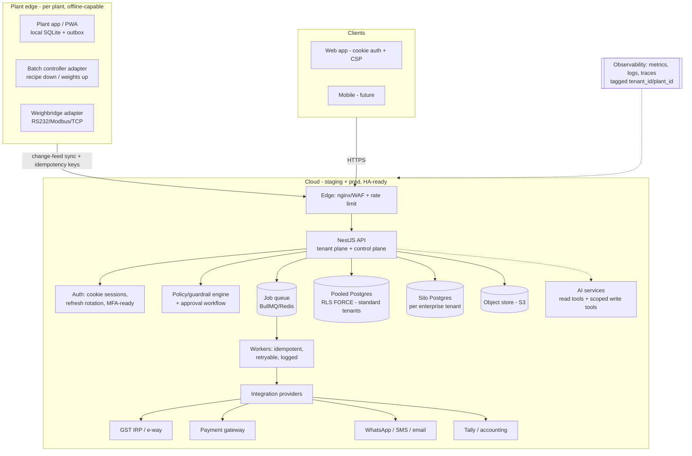
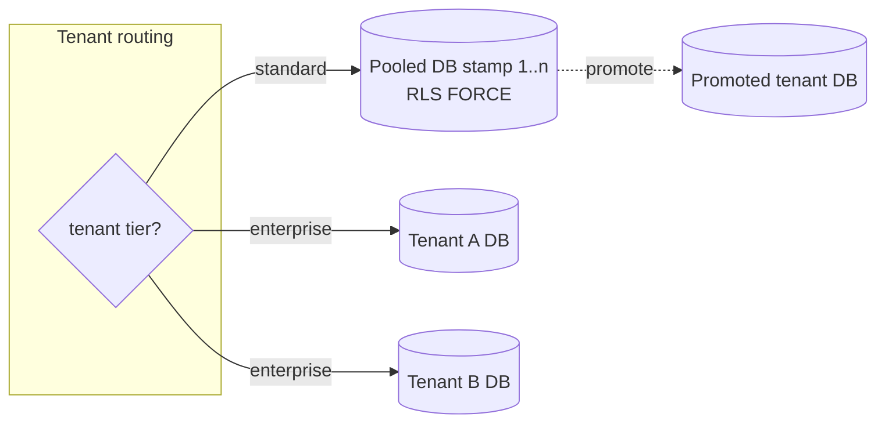
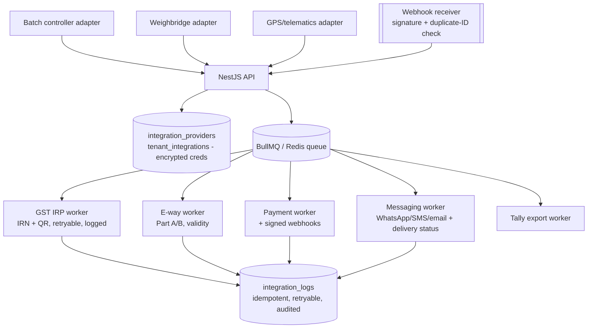
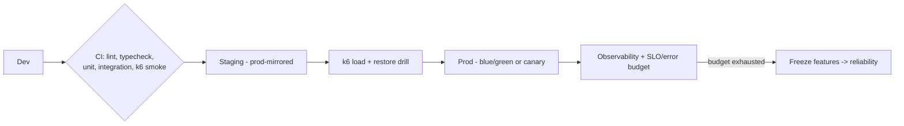

# Target Hybrid Architecture — Mix Nova RMC

> The to-be architecture: **hybrid tenancy** (pooled RLS now, database-per-tenant
> for large accounts later), **hybrid connectivity** (cloud authority + edge/
> offline plant capture), a real **integration/edge layer**, and the reliability
> spine (staging, CI/CD, observability, HA-when-earned). It evolves the current
> NestJS + Next.js + PostgreSQL-RLS stack rather than replacing it — because the
> core is already built to the right standard. No implementation here.

## 1. Design principles

1. **Keep the strong core.** DB-enforced RLS, non-superuser app role, append-only
   audit, and block-not-approve guardrails are correct — the target *extends*
   them, never rewrites them.
2. **Cloud is the system of record; the edge is a resilient capture buffer.**
   Batching/challan/weighbridge run locally under the 90-minute clock; the cloud
   remains authoritative and reconciles via a monotonic change-feed.
3. **Isolation is a spectrum.** Start pooled; **promote large/enterprise tenants
   to their own database** without a schema change (identical schema so a tenant
   can be "lifted").
4. **Integrations behind a provider abstraction**, not hardcoded per feature — so
   adding Razorpay, an IRP, or a batch controller is "configure a provider," not
   a greenfield build.
5. **Reversibility-first automation** — the autonomy guardrail layer
   (`AUTONOMOUS_PRODUCT_BLUEPRINT.md`) is part of the architecture, not bolted on.
6. **Earn complexity.** HA, database-per-tenant, and edge autonomy arrive when
   SLA commitments and tenant scale justify them — driven by error-budget data,
   not aspiration.

## 2. Target context diagram

## 3. Tenancy evolution: pooled → hybrid bridge

**Now (correct for pilot):** pooled PostgreSQL, one schema, `tenant_id` +
`FORCE RLS`, `plant_id` as a secondary scope. This is the benchmark-endorsed
starting point and it is already implemented to the safe recipe.

**Target (as tenants scale):** the **bridge/hybrid** model —
- Standard tenants stay pooled (best density, cheapest onboarding).
- **Large/enterprise/compliance-sensitive tenants get a dedicated database**
  (silo) — sold as a premium tier — eliminating noisy-neighbor and enabling
  **native per-tenant backup/PITR and restore** (which pooled RLS makes hard).
- A tenant is **promotable pool→silo** with no schema change: the schema is
  identical, so a promotion is a data move + a routing flip.
- **Deployment stamps** (replicable units each serving a bounded set of tenants)
  cap blast radius as the pooled tier grows.

**Guardrails carried forward (already right, keep enforced):** `FORCE ROW LEVEL
SECURITY`, non-owner/non-`BYPASSRLS` app role, `SET LOCAL` per transaction,
`USING`+`WITH CHECK`, `tenant_id`-leading composite indexes, fail-closed on
missing GUC. **Add:** RLS (or a DB tenant guard) on `users`/`tenant_modules`, and
`(tenant_id, id)` composite FKs so tenant co-membership is a DB invariant.

## 4. Connectivity: cloud authority + edge capture

The offline design in `OFFLINE_SYNC_AND_CONFLICT_STRATEGY.md` is the connectivity
half of this architecture. Summary of the target:
- **Local-first capture** for challan/batch/weighbridge/inward/dispatch-update.
- **Monotonic change-feed** (`change_seq` or an append-only change-log) replaces
  the wall-clock cursor.
- **UUIDv7 idempotency keys** on every operation; server stores result per key.
- **Server-authoritative, event-sourced writes** for money/inventory; LWW only
  for cosmetic fields; genuine conflicts surface to an authorised human and are
  audited.
- **Per-device credentials**, `status==='active'` enforcement, encrypted local
  store, bounded offline-login expiry.
- **Build-vs-buy:** evolve the custom outbox, or adopt **PowerSync** (writes
  routed back through the NestJS API so RLS stays authoritative) if offline
  breadth must expand. Recorded as an ADR.

## 5. Integration & edge layer (the biggest structural addition)

Today integrations are hardcoded per feature and mostly absent. The target
introduces the **provider registry** the design already envisions
(`integration_providers`, `tenant_integrations` with encrypted `credentials_ref`,
`integration_logs`, `batching_connector_configs`) plus a **job queue** and a
**webhook layer**.

**Principles:**
- Every external call is an **idempotent, retryable, logged** background job — not
  an inline request (which is how WhatsApp/Tally run today).
- Credentials live in a **secret store**, referenced by `credentials_ref`, never
  in plaintext env.
- **Human sign-off precedes transmission** for IRN/e-way (L2), then the network
  call is an L3 bounded job — the decision was human, the mechanics are automated.
- **Batch-controller / weighbridge adapters** are the domain table-stakes (two-way
  recipe/weights, RS232/Modbus/TCP). They sit at the plant edge and feed the
  cloud through the same change-feed sync as the plant app.

## 6. Application & auth evolution

- **Auth:** access token in memory + **refresh token in an httpOnly/Secure/
  SameSite cookie** with **rotation + reuse detection**; CSRF tokens on
  state-changing routes; **fail boot on default/empty JWT secrets**; MFA-ready.
- **API hardening:** Helmet on API responses; tighten CSP off
  `unsafe-inline`/`unsafe-eval` as hydration allows; edge WAF + rate limiting.
- **Validation:** typed DTOs + DB **CHECK constraints** (non-negative money/qty,
  status enums) as defense-in-depth beneath the app-layer validators.
- **Approval engine:** one generic `approval_requests`/`approval_actions`
  subsystem backing every L2 "prepare" action (credit-hold, negative-stock,
  discount, invoice-cancel, mix-approve, and future automation).

## 7. Reliability spine

- **Environments:** distinct Dev / Staging / Prod; promote through them.
- **CI/CD:** extend CI with **unit tests + coverage**, wire the existing manual
  `tests/` (isolation/RBAC/security/UAT) into the gate, add **k6 smoke** with
  latency thresholds; add a **CD path** (blue/green or canary) so deploy stops
  being a single manual operator action.
- **Backups/DR:** keep GFS + the rehearsed restore drill; **configure off-box
  copies** (the plumbing exists, unset today); **quantify RPO/RTO**; validate
  **per-tenant restore** (a reason to silo big tenants).
- **Observability:** metrics + structured logs + traces via OpenTelemetry,
  **tagged by `tenant_id`/`plant_id`** to catch noisy neighbors and per-tenant
  SLO breaches; feed security/auth anomalies to alerting.
- **HA when earned:** single well-backed box is defensible at pilot; move to
  **multi-AZ managed Postgres + stateless, horizontally-scaled app tier + a load
  balancer** as enterprise SLAs arrive. Let error-budget data trigger the upgrade.

## 8. Autonomy layer

The policy/guardrail engine, scoped tools, approval workflow, reversibility/
rollback, immutable proposal audit, and per-tenant kill switch from
`AUTONOMOUS_PRODUCT_BLUEPRINT.md` are **first-class architectural components**,
positioned between the API and any write tool. No automation exceeds L2 until this
layer exists; nothing financial/legal/safety ever exceeds L4.

## 9. Migration posture (how we get there without a rewrite)

- **Non-breaking, additive.** Every target element (change-feed columns, provider
  registry, queue/workers, cookie auth, CHECK constraints, `users` RLS) is an
  additive migration or a parallel subsystem — none require replacing the data
  model or the RLS design.
- **Strangler pattern for integrations:** the inline WhatsApp/Tally paths become
  provider-registry workers behind the same API surface; clients don't change.
- **Tenancy promotion is data-movement, not redesign** because the schema is
  already `tenant_id`-scoped and identical pool-vs-silo.

The full ordering — what depends on what — is in
`DEPENDENCY_AWARE_IMPLEMENTATION_ROADMAP.md`; the key decisions and their
trade-offs are in `ARCHITECTURE_DECISION_REGISTER.md`.
