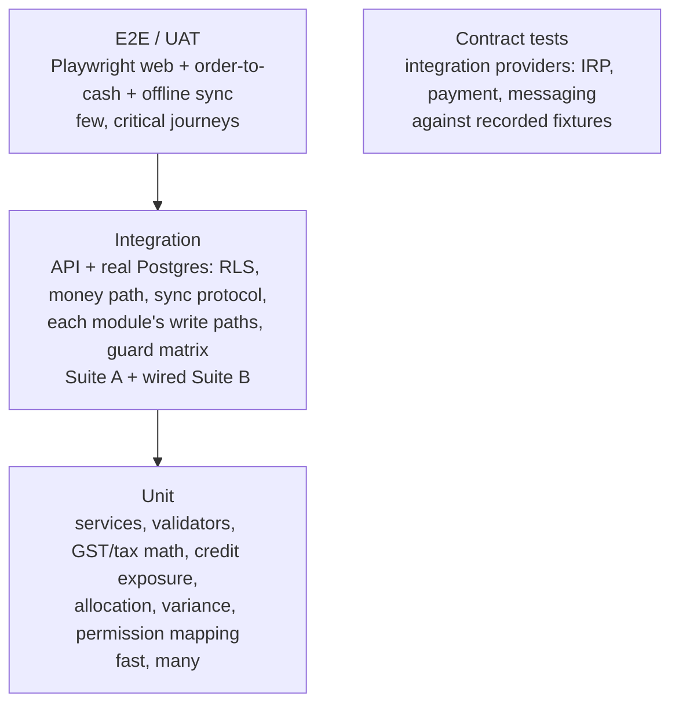

# Test & Resilience Strategy — Mix Nova RMC

> Current test reality, the honest coverage gaps, and a target test pyramid +
> resilience/DR plan (RPO/RTO, load, chaos, observability, staging/CD). Anchored
> to the As-Is audit; no implementation here.

## 1. What exists today

Two independent suites, **only one of which runs in CI**.

### Suite A — `apps/api/test/` (runs in CI via `test:integration`)
An orchestrator (`run-integration.mjs`) migrates an empty Postgres, seeds the
platform, boots the real API as the non-superuser app role, creates a tenant +
owner + plant, then runs four files:

| File | Covers | Strength |
|---|---|---|
| `rls-isolation.test.mjs` | Tenant isolation invariants | **High** — 9 checks against the real app role (not superuser, no bypass, fail-closed, cross-read=0, cross-insert refused, cannot disable RLS or `SET ROLE`). |
| `stock-ledger.integration.test.mjs` | Null-plant ghost-row fix (QA #1) | **High** — runs the real compiled `StockService`; asserts one balance row, no ghost, DB rejects null `plant_id`. |
| `master-validation.test.mjs` | GSTIN/mobile/credit validation | Medium — unit + `POST /customers` structured-400. |
| `order-to-cash.test.mjs` | Money path | Medium — shells the full quotation→…→invoice→receipt cycle, asserts the ₹ total. |

### Suite B — `tests/` (manual, `test:e2e`, **NOT in CI**)
Richer, but nobody's automated gate: `tenant-isolation.mjs` (self-labelled "CI
gate" yet unwired), `rbac-authorization.mjs` (view-only 403 across 13 endpoints),
`uat-e2e.mjs` (12-stage order-to-cash + offline sync + exact GST math),
`security.mjs` (no `passwordHash` leak, static secret scan, login 429).

### CI pipeline
`ci.yml`: `build` job (install → lint → typecheck → build) + `integration` job
(Postgres service → build shared+api → integration suite). No CD; deploy is the
manual `redeploy.sh`.

## 2. The honest coverage gaps

| Gap | Detail |
|---|---|
| **Zero unit-test coverage** | No jest/vitest/nyc/c8 anywhere; `api`/`web` `test` scripts are `echo` stubs. **0%** conventional unit coverage. |
| **Large untested API surface** | `ai/*`, billing internals/tax util beyond happy path, `sync` server, `platform` tenant lifecycle, `audit`, `alerts`, credit-hold logic, weighbridge, negative-stock — untested by CI. RBAC/isolation breadth only in the **manual** Suite B. |
| **Web has no tests** | No component/render tests, no Playwright/Cypress; only a static secret grep. |
| **Suite B not wired** | The strongest isolation/RBAC/security assertions never run automatically. |
| **No load/perf tests** | NFR scale/SLA numbers are still "to be quantified"; no k6/artillery. |
| **No chaos/failure injection** | No test that the app fails *closed* under DB loss, pool exhaustion, or a killed dependency. |
| **Sync correctness untested where it's weakest** | The wall-clock cursor lost-update path (BUG-1) and idempotency-on-retry (BUG-2) have no regression test. |

## 3. Target test pyramid

**Priorities, in order:**
1. **Wire Suite B into CI** — instant, large coverage win (isolation, RBAC,
   security, UAT). Provision the seeded stack the suite needs in the CI job.
2. **Add a unit runner (vitest) + coverage gate** starting with the highest-risk
   pure logic: **GST/tax computation, credit exposure, receipt allocation, batch
   variance, permission→action mapping, the shared validators.** These are exactly
   the deterministic calculations where a silent regression costs money.
3. **Sync-protocol regression tests** encoding BUG-1/BUG-2 (lost-update on the
   cursor, idempotent retry) — so the offline fixes are provably correct.
4. **Per-module integration tests** for the untested write paths (platform
   lifecycle, negative-stock/credit-hold approvals, weighbridge, billing
   cancel/reissue).
5. **Web E2E (Playwright)** for the money journeys and the login/permission gates,
   using the pre-installed Chromium.
6. **Contract tests** for each integration provider (IRP, payment, messaging)
   against recorded fixtures, so live-integration work has a safety net.

**Coverage target:** start by *measuring* (no number is meaningful until a runner
exists); then gate new/changed code at a pragmatic line/branch threshold on the
`ai`-free business core, ratcheting up. Don't chase a global % on day one.

## 4. Resilience & DR

### 4.1 RPO / RTO — quantify them (currently undefined)
| Metric | Proposed pilot target | Basis |
|---|---|---|
| **RPO** (max data loss) | ≤ 24 h now (daily GFS) → **≤ 1 h** with WAL/PITR before real multi-tenant data | Daily dumps today; PITR is the noted pre-scale hardening. |
| **RTO** (max downtime) | ≤ 4 h now (manual restore on one box) → **≤ 1 h** with staging + tested restore | Time the rehearsed drill against this target. |

Publish these as the DR SLO and **measure the restore drill against RTO** each run.

### 4.2 Backups (keep the good, fix the gap)
- Keep GFS (7 daily / 4 weekly / 3 monthly) + the **rehearsed monthly restore
  drill** (`verify-restore.sh`) + Acronis VM image.
- **Configure off-box copies** — `RMC_OFFBOX_RCLONE`/`SCP` plumbing exists but is
  unset; on-box backups die with the box. This is the single most important DR
  fix. (Minor: correct the "we ship 14 migrations" comment — it is 15.)
- Add **WAL archiving / PITR** before onboarding a second real tenant.
- Validate **per-tenant restore** (hard under pooled RLS → reinforces siloing big
  tenants).

### 4.3 Load & chaos
- **k6 smoke in CI** (a few RPS on the money path, latency thresholds fail the
  build) + **heavier load in staging** mirrored to prod volume, to finally put
  numbers on the NFR SLA.
- **Chaos/failure drills:** kill Postgres / exhaust the pool / drop the AI
  dependency and assert the app **fails closed** and surfaces the right envelope
  — the 4 GB single box makes graceful degradation important.

### 4.4 Observability (the biggest operational gap)
Today: container healthchecks + two cron shell monitors + a generic webhook. No
APM/metrics/tracing/log-aggregation/error-tracking.
Target: **OpenTelemetry metrics + structured logs + traces, tagged by
`tenant_id`/`plant_id`**, an error tracker (e.g. Sentry-class), and log
aggregation — so mean-time-to-detect for anything short of a hard-down improves,
and per-tenant SLO/noisy-neighbor problems are visible.

### 4.5 SLO & error budget
Adopt a modest, honest SLO (e.g. **99.5–99.9%** on the core dispatch/billing API,
not 99.99%), compute the error budget (1 − SLO), and a policy: when the 4-week
budget is exhausted, **freeze features and shift to reliability** until back in
SLO. Let this data — not aspiration — trigger the HA upgrade.

## 5. Environments & delivery

- **Add a staging environment** mirrored to prod (the biggest single reliability
  gap — there is nowhere to validate a deploy today).
- **Introduce CD** (blue/green or canary behind the load balancer) so deploy stops
  being one operator running a script on the live box; the freshness guard and
  pre-redeploy backup stay as belt-and-braces.
- **Keep the manual `redeploy.sh` path** as the break-glass fallback.

## 6. What "resilient enough for a wider pilot" means

Concretely, before onboarding a second paying tenant:
1. Off-box backups configured and a restore drill **timed against a stated RTO**.
2. Suite B wired into CI + a unit runner with the money-math covered.
3. Basic observability (metrics + error tracking + per-tenant tags).
4. Sync BUG-1/BUG-2 fixed with regression tests (if offline is in the second
   tenant's scope).
5. A staging environment for deploy validation.

These are the resilience prerequisites the roadmap sequences first.
